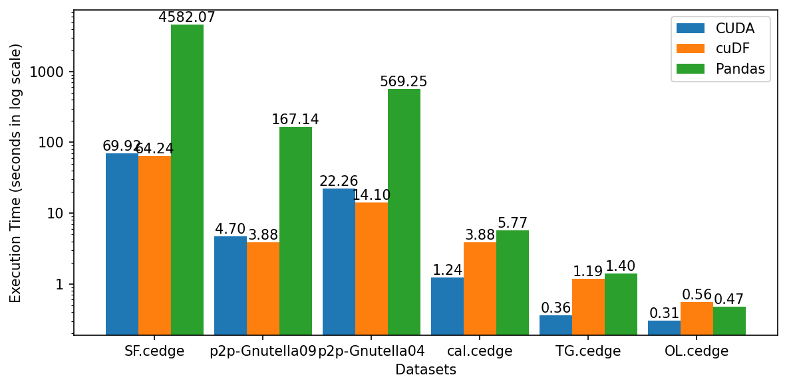
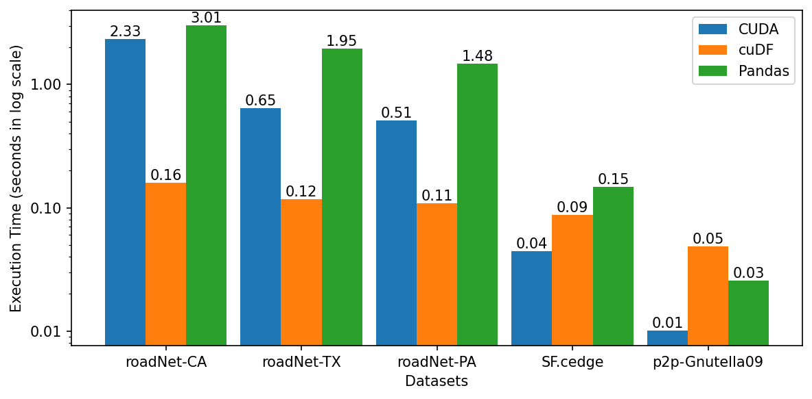

# Comparison between cuDF and Pandas for Accelerating Datalog applications with cuDF
- **Please open [rapids_implementation folder](rapids_implementation) that contains the comparison between cuDF and Pandas.**
- The following sections are for the CUDA implementations of inner joins

## Transitive closure
- Use hash join (open addressing, linear probing)
- Intermediate times:

- Local run:
```shell
Benchmark for TG.cedge
----------------------------------------------------------
| Iteration | # Join | # Deduplicated join | # Union | # Deduplicated union | Join(s) | Deduplication(s) | Projection(s) | Union(s) |
| --- | --- | --- | --- | --- | --- | --- | --- | --- |
| 1 | 24,274 | 22,471 | 46,345 | 23,874 | 0.0004 | 0.0008 | 0.0002 | 0.0000 |
| 2 | 25,228 | 22,375 | 68,213 | 45,838 | 0.0007 | 0.0015 | 0.0002 | 0.0003 |
| 3 | 27,477 | 23,637 | 90,261 | 66,624 | 0.0010 | 0.0026 | 0.0004 | 0.0015 |
| 4 | 30,638 | 25,782 | 112,796 | 87,014 | 0.0014 | 0.0036 | 0.0004 | 0.0018 |
| 5 | 34,619 | 28,560 | 135,881 | 107,321 | 0.0017 | 0.0048 | 0.0004 | 0.0018 |
| 6 | 39,237 | 31,840 | 159,507 | 127,667 | 0.0020 | 0.0063 | 0.0005 | 0.0021 |
| 7 | 44,299 | 35,460 | 183,467 | 148,007 | 0.0023 | 0.0088 | 0.0005 | 0.0025 |
| 8 | 49,741 | 39,337 | 207,559 | 168,222 | 0.0035 | 0.0101 | 0.0005 | 0.0029 |
| 9 | 55,442 | 43,371 | 231,520 | 188,149 | 0.0038 | 0.0116 | 0.0005 | 0.0034 |
| 10 | 61,196 | 47,414 | 255,161 | 207,747 | 0.0043 | 0.0138 | 0.0006 | 0.0038 |
| 11 | 66,811 | 51,351 | 278,288 | 226,937 | 0.0048 | 0.0155 | 0.0006 | 0.0042 |
| 12 | 72,325 | 55,127 | 300,696 | 245,569 | 0.0054 | 0.0171 | 0.0006 | 0.0045 |
| 13 | 77,517 | 58,670 | 322,248 | 263,578 | 0.0059 | 0.0199 | 0.0007 | 0.0050 |
| 14 | 82,402 | 62,029 | 342,927 | 280,898 | 0.0083 | 0.0218 | 0.0008 | 0.0056 |
| 15 | 86,914 | 65,016 | 362,511 | 297,495 | 0.0089 | 0.0237 | 0.0010 | 0.0060 |
| 16 | 91,053 | 67,792 | 381,097 | 313,305 | 0.0092 | 0.0258 | 0.0012 | 0.0066 |
| 17 | 94,711 | 70,145 | 398,552 | 328,407 | 0.0096 | 0.0281 | 0.0014 | 0.0069 |
| 18 | 97,580 | 71,909 | 414,545 | 342,636 | 0.0100 | 0.0302 | 0.0017 | 0.0075 |
| 19 | 99,605 | 73,064 | 428,981 | 355,917 | 0.0103 | 0.0325 | 0.0017 | 0.0107 |
| 20 | 100,798 | 73,683 | 441,904 | 368,221 | 0.0107 | 0.0345 | 0.0021 | 0.0112 |
| 21 | 101,377 | 73,821 | 453,422 | 379,601 | 0.0110 | 0.0371 | 0.0023 | 0.0118 |
| 22 | 101,272 | 73,437 | 463,581 | 390,144 | 0.0120 | 0.0392 | 0.0023 | 0.0126 |
| 23 | 100,639 | 72,723 | 472,509 | 399,786 | 0.0124 | 0.0414 | 0.0025 | 0.0131 |
| 24 | 99,452 | 71,591 | 480,191 | 408,600 | 0.0139 | 0.0454 | 0.0029 | 0.0138 |
| 25 | 97,752 | 70,144 | 486,766 | 416,622 | 0.0142 | 0.0487 | 0.0029 | 0.0151 |
| 26 | 95,644 | 68,467 | 492,378 | 423,911 | 0.0146 | 0.0510 | 0.0031 | 0.0156 |
| 27 | 93,239 | 66,570 | 497,115 | 430,545 | 0.0149 | 0.0535 | 0.0031 | 0.0160 |
| 28 | 90,494 | 64,480 | 501,051 | 436,571 | 0.0152 | 0.0582 | 0.0032 | 0.0164 |
| 29 | 87,553 | 62,259 | 504,300 | 442,041 | 0.0160 | 0.0607 | 0.0032 | 0.0179 |
| 30 | 84,326 | 59,796 | 506,795 | 446,999 | 0.0163 | 0.0629 | 0.0032 | 0.0184 |
| 31 | 80,888 | 57,243 | 508,667 | 451,424 | 0.0166 | 0.0652 | 0.0032 | 0.0191 |
| 32 | 77,279 | 54,559 | 509,936 | 455,377 | 0.0169 | 0.0674 | 0.0034 | 0.0196 |
| 33 | 73,506 | 51,796 | 510,692 | 458,896 | 0.0173 | 0.0699 | 0.0034 | 0.0228 |
| 34 | 69,658 | 49,012 | 510,990 | 461,978 | 0.0176 | 0.0723 | 0.0035 | 0.0233 |
| 35 | 65,786 | 46,217 | 510,876 | 464,659 | 0.0179 | 0.0746 | 0.0035 | 0.0239 |
| 36 | 61,999 | 43,494 | 510,509 | 467,015 | 0.0182 | 0.0769 | 0.0036 | 0.0244 |
| 37 | 58,359 | 40,877 | 510,000 | 469,123 | 0.0185 | 0.0803 | 0.0036 | 0.0251 |
| 38 | 54,900 | 38,399 | 509,407 | 471,008 | 0.0211 | 0.0826 | 0.0036 | 0.0259 |
| 39 | 51,604 | 35,988 | 508,675 | 472,687 | 0.0214 | 0.0848 | 0.0036 | 0.0263 |
| 40 | 48,440 | 33,679 | 507,831 | 474,152 | 0.0217 | 0.0872 | 0.0036 | 0.0267 |
| 41 | 45,405 | 31,442 | 506,850 | 475,408 | 0.0220 | 0.0905 | 0.0036 | 0.0275 |
| 42 | 42,450 | 29,250 | 505,726 | 476,476 | 0.0223 | 0.0927 | 0.0037 | 0.0279 |
| 43 | 39,519 | 27,107 | 504,489 | 477,382 | 0.0226 | 0.0972 | 0.0038 | 0.0287 |
| 44 | 36,686 | 25,048 | 503,200 | 478,152 | 0.0230 | 0.0995 | 0.0038 | 0.0291 |
| 45 | 33,893 | 23,074 | 501,869 | 478,795 | 0.0233 | 0.1022 | 0.0039 | 0.0295 |
| 46 | 31,213 | 21,168 | 500,499 | 479,331 | 0.0236 | 0.1044 | 0.0039 | 0.0301 |
| 47 | 28,619 | 19,362 | 499,123 | 479,761 | 0.0239 | 0.1065 | 0.0039 | 0.0308 |
| 48 | 26,111 | 17,640 | 497,743 | 480,103 | 0.0242 | 0.1092 | 0.0039 | 0.0339 |
| 49 | 23,708 | 16,033 | 496,409 | 480,376 | 0.0245 | 0.1124 | 0.0040 | 0.0344 |
| 50 | 21,452 | 14,527 | 495,124 | 480,597 | 0.0249 | 0.1170 | 0.0040 | 0.0352 |
| 51 | 19,335 | 13,113 | 493,887 | 480,774 | 0.0252 | 0.1193 | 0.0040 | 0.0359 |
| 52 | 17,335 | 11,765 | 492,671 | 480,906 | 0.0255 | 0.1220 | 0.0040 | 0.0385 |
| 53 | 15,437 | 10,504 | 491,502 | 480,998 | 0.0258 | 0.1241 | 0.0040 | 0.0391 |
| 54 | 13,678 | 9,324 | 490,383 | 481,059 | 0.0261 | 0.1269 | 0.0040 | 0.0398 |
| 55 | 12,059 | 8,247 | 489,343 | 481,096 | 0.0264 | 0.1295 | 0.0040 | 0.0404 |
| 56 | 10,599 | 7,270 | 488,384 | 481,114 | 0.0267 | 0.1316 | 0.0041 | 0.0411 |
| 57 | 9,261 | 6,366 | 487,486 | 481,120 | 0.0270 | 0.1370 | 0.0041 | 0.0416 |
| 58 | 8,069 | 5,573 | 486,694 | 481,121 | 0.0273 | 0.1390 | 0.0041 | 0.0420 |

| Dataset | Number of rows | TC size | Iterations | Blocks x Threads | Time (s) |
| --- | --- | --- | --- | --- | --- |
| TG.cedge | 23,874 | 481,121 | 58 | 320 x 1,024 | 0.3478 |


Initialization: 0.1227, Read: 0.0038, reverse: 0.0005
Hashtable rate: 809,699,847 keys/s, time: 0.0000
Join: 0.0273
Projection: 0.0041
Deduplication: 0.1390
Memory clear: 0.0082
Union: 0.0421
Total: 0.3478

Benchmark for OL.cedge
----------------------------------------------------------
| Iteration | # Join | # Deduplicated join | # Union | # Deduplicated union | Join(s) | Deduplication(s) | Projection(s) | Union(s) |
| --- | --- | --- | --- | --- | --- | --- | --- | --- |
| 1 | 7,445 | 7,331 | 14,366 | 7,035 | 0.0004 | 0.0009 | 0.0000 | 0.0000 |
| 2 | 7,784 | 7,628 | 21,947 | 14,319 | 0.0007 | 0.0016 | 0.0000 | 0.0000 |
| 3 | 8,049 | 7,848 | 29,661 | 21,813 | 0.0010 | 0.0026 | 0.0000 | 0.0001 |
| 4 | 8,248 | 8,017 | 37,369 | 29,352 | 0.0012 | 0.0034 | 0.0001 | 0.0001 |
| 5 | 8,390 | 8,134 | 44,985 | 36,851 | 0.0015 | 0.0040 | 0.0001 | 0.0001 |
| 6 | 8,489 | 8,214 | 52,449 | 44,235 | 0.0018 | 0.0052 | 0.0001 | 0.0001 |
| 7 | 8,552 | 8,263 | 59,704 | 51,441 | 0.0021 | 0.0060 | 0.0001 | 0.0002 |
| 8 | 8,610 | 8,293 | 66,717 | 58,424 | 0.0024 | 0.0067 | 0.0001 | 0.0003 |
| 9 | 8,681 | 8,321 | 73,468 | 65,147 | 0.0039 | 0.0074 | 0.0001 | 0.0006 |
| 10 | 8,716 | 8,317 | 79,913 | 71,596 | 0.0042 | 0.0081 | 0.0001 | 0.0009 |
| 11 | 8,783 | 8,357 | 86,051 | 77,694 | 0.0045 | 0.0090 | 0.0001 | 0.0012 |
| 12 | 8,885 | 8,415 | 91,872 | 83,457 | 0.0048 | 0.0097 | 0.0002 | 0.0012 |
| 13 | 8,985 | 8,448 | 97,342 | 88,894 | 0.0051 | 0.0109 | 0.0002 | 0.0013 |
| 14 | 9,073 | 8,467 | 102,451 | 93,984 | 0.0054 | 0.0119 | 0.0002 | 0.0015 |
| 15 | 9,125 | 8,463 | 107,201 | 98,738 | 0.0057 | 0.0129 | 0.0002 | 0.0017 |
| 16 | 9,158 | 8,424 | 111,585 | 103,161 | 0.0060 | 0.0140 | 0.0002 | 0.0020 |
| 17 | 9,139 | 8,352 | 115,604 | 107,252 | 0.0064 | 0.0154 | 0.0004 | 0.0027 |
| 18 | 9,076 | 8,248 | 119,263 | 111,015 | 0.0067 | 0.0164 | 0.0004 | 0.0029 |
| 19 | 9,006 | 8,133 | 122,593 | 114,460 | 0.0070 | 0.0175 | 0.0004 | 0.0031 |
| 20 | 8,889 | 7,979 | 125,598 | 117,619 | 0.0073 | 0.0205 | 0.0004 | 0.0034 |
| 21 | 8,692 | 7,754 | 128,229 | 120,475 | 0.0077 | 0.0219 | 0.0004 | 0.0036 |
| 22 | 8,494 | 7,541 | 130,552 | 123,011 | 0.0080 | 0.0231 | 0.0005 | 0.0038 |
| 23 | 8,273 | 7,341 | 132,649 | 125,308 | 0.0083 | 0.0242 | 0.0005 | 0.0041 |
| 24 | 8,045 | 7,127 | 134,563 | 127,436 | 0.0086 | 0.0257 | 0.0005 | 0.0043 |
| 25 | 7,776 | 6,877 | 136,276 | 129,399 | 0.0089 | 0.0269 | 0.0005 | 0.0046 |
| 26 | 7,468 | 6,591 | 137,790 | 131,199 | 0.0092 | 0.0281 | 0.0005 | 0.0049 |
| 27 | 7,103 | 6,259 | 139,087 | 132,828 | 0.0095 | 0.0293 | 0.0005 | 0.0051 |
| 28 | 6,697 | 5,883 | 140,158 | 134,275 | 0.0097 | 0.0304 | 0.0005 | 0.0053 |
| 29 | 6,234 | 5,469 | 141,005 | 135,536 | 0.0100 | 0.0328 | 0.0005 | 0.0056 |
| 30 | 5,754 | 5,038 | 141,671 | 136,633 | 0.0112 | 0.0341 | 0.0006 | 0.0060 |
| 31 | 5,263 | 4,611 | 142,200 | 137,589 | 0.0115 | 0.0354 | 0.0006 | 0.0065 |
| 32 | 4,777 | 4,192 | 142,621 | 138,429 | 0.0122 | 0.0368 | 0.0006 | 0.0072 |
| 33 | 4,302 | 3,797 | 142,975 | 139,178 | 0.0125 | 0.0379 | 0.0006 | 0.0074 |
| 34 | 3,864 | 3,427 | 143,274 | 139,847 | 0.0128 | 0.0392 | 0.0006 | 0.0078 |
| 35 | 3,444 | 3,071 | 143,523 | 140,452 | 0.0131 | 0.0404 | 0.0006 | 0.0080 |
| 36 | 3,036 | 2,726 | 143,721 | 140,995 | 0.0134 | 0.0416 | 0.0006 | 0.0084 |
| 37 | 2,669 | 2,414 | 143,895 | 141,481 | 0.0136 | 0.0429 | 0.0006 | 0.0087 |
| 38 | 2,344 | 2,134 | 144,058 | 141,924 | 0.0139 | 0.0463 | 0.0007 | 0.0090 |
| 39 | 2,062 | 1,887 | 144,214 | 142,327 | 0.0148 | 0.0479 | 0.0007 | 0.0093 |
| 40 | 1,806 | 1,665 | 144,359 | 142,694 | 0.0151 | 0.0490 | 0.0007 | 0.0096 |
| 41 | 1,576 | 1,467 | 144,501 | 143,034 | 0.0153 | 0.0501 | 0.0007 | 0.0098 |
| 42 | 1,364 | 1,280 | 144,640 | 143,360 | 0.0156 | 0.0513 | 0.0007 | 0.0100 |
| 43 | 1,174 | 1,109 | 144,784 | 143,675 | 0.0159 | 0.0524 | 0.0007 | 0.0103 |
| 44 | 1,010 | 960 | 144,936 | 143,976 | 0.0162 | 0.0535 | 0.0007 | 0.0106 |
| 45 | 866 | 824 | 145,088 | 144,264 | 0.0165 | 0.0547 | 0.0007 | 0.0109 |
| 46 | 744 | 709 | 145,241 | 144,532 | 0.0167 | 0.0559 | 0.0008 | 0.0112 |
| 47 | 638 | 608 | 145,387 | 144,779 | 0.0170 | 0.0573 | 0.0008 | 0.0115 |
| 48 | 548 | 523 | 145,525 | 145,002 | 0.0193 | 0.0584 | 0.0008 | 0.0118 |
| 49 | 462 | 445 | 145,643 | 145,198 | 0.0196 | 0.0596 | 0.0008 | 0.0121 |
| 50 | 393 | 379 | 145,748 | 145,369 | 0.0199 | 0.0607 | 0.0008 | 0.0123 |
| 51 | 332 | 322 | 145,840 | 145,518 | 0.0202 | 0.0618 | 0.0008 | 0.0126 |
| 52 | 281 | 272 | 145,917 | 145,645 | 0.0204 | 0.0629 | 0.0008 | 0.0128 |
| 53 | 235 | 227 | 145,982 | 145,755 | 0.0207 | 0.0640 | 0.0008 | 0.0131 |
| 54 | 197 | 190 | 146,037 | 145,847 | 0.0210 | 0.0652 | 0.0009 | 0.0134 |
| 55 | 162 | 158 | 146,080 | 145,922 | 0.0213 | 0.0668 | 0.0009 | 0.0139 |
| 56 | 133 | 130 | 146,110 | 145,980 | 0.0219 | 0.0679 | 0.0009 | 0.0142 |
| 57 | 107 | 105 | 146,129 | 146,024 | 0.0222 | 0.0692 | 0.0020 | 0.0156 |
| 58 | 83 | 81 | 146,138 | 146,057 | 0.0225 | 0.0703 | 0.0021 | 0.0158 |
| 59 | 63 | 61 | 146,143 | 146,082 | 0.0228 | 0.0715 | 0.0021 | 0.0161 |
| 60 | 44 | 44 | 146,142 | 146,098 | 0.0231 | 0.0728 | 0.0021 | 0.0165 |
| 61 | 34 | 34 | 146,143 | 146,109 | 0.0233 | 0.0739 | 0.0021 | 0.0168 |
| 62 | 24 | 24 | 146,140 | 146,116 | 0.0237 | 0.0754 | 0.0021 | 0.0172 |
| 63 | 17 | 17 | 146,136 | 146,119 | 0.0241 | 0.0767 | 0.0021 | 0.0176 |
| 64 | 12 | 12 | 146,132 | 146,120 | 0.0244 | 0.0803 | 0.0021 | 0.0179 |

| Dataset | Number of rows | TC size | Iterations | Blocks x Threads | Time (s) |
| --- | --- | --- | --- | --- | --- |
| OL.cedge | 7,035 | 146,120 | 64 | 320 x 1,024 | 0.4737 |


Initialization: 0.1233, Read: 0.0011, reverse: 0.0001
Hashtable rate: 585,615,583 keys/s, time: 0.0000
Join: 0.0517
Projection: 0.0062
Deduplication: 0.2193
Memory clear: 0.0118
Union: 0.0601
Total: 0.4737
```


```shell
 nvprof ./join                     
Benchmark for TG.cedge
----------------------------------------------------------
==23177== NVPROF is profiling process 23177, command: ./join
| Iteration | # Join | # Deduplicated join | # Union | # Deduplicated union |
| --- | --- | --- | --- | --- |
| 1 | 24,274 | 22,471 | 46,345 | 23,874 |
| 2 | 25,228 | 22,375 | 68,213 | 45,838 |
| 3 | 27,477 | 23,637 | 90,261 | 66,624 |
| 4 | 30,638 | 25,782 | 112,796 | 87,014 |
| 5 | 34,619 | 28,560 | 135,881 | 107,321 |
| 6 | 39,237 | 31,840 | 159,507 | 127,667 |
| 7 | 44,299 | 35,460 | 183,467 | 148,007 |
| 8 | 49,741 | 39,337 | 207,559 | 168,222 |
| 9 | 55,442 | 43,371 | 231,520 | 188,149 |
| 10 | 61,196 | 47,414 | 255,161 | 207,747 |
| 11 | 66,811 | 51,351 | 278,288 | 226,937 |
| 12 | 72,325 | 55,127 | 300,696 | 245,569 |
| 13 | 77,517 | 58,670 | 322,248 | 263,578 |
| 14 | 82,402 | 62,029 | 342,927 | 280,898 |
| 15 | 86,914 | 65,016 | 362,511 | 297,495 |
| 16 | 91,053 | 67,792 | 381,097 | 313,305 |
| 17 | 94,711 | 70,145 | 398,552 | 328,407 |
| 18 | 97,580 | 71,909 | 414,545 | 342,636 |
| 19 | 99,605 | 73,064 | 428,981 | 355,917 |
| 20 | 100,798 | 73,683 | 441,904 | 368,221 |
| 21 | 101,377 | 73,821 | 453,422 | 379,601 |
| 22 | 101,272 | 73,437 | 463,581 | 390,144 |
| 23 | 100,639 | 72,723 | 472,509 | 399,786 |
| 24 | 99,452 | 71,591 | 480,191 | 408,600 |
| 25 | 97,752 | 70,144 | 486,766 | 416,622 |
| 26 | 95,644 | 68,467 | 492,378 | 423,911 |
| 27 | 93,239 | 66,570 | 497,115 | 430,545 |
| 28 | 90,494 | 64,480 | 501,051 | 436,571 |
| 29 | 87,553 | 62,259 | 504,300 | 442,041 |
| 30 | 84,326 | 59,796 | 506,795 | 446,999 |
| 31 | 80,888 | 57,243 | 508,667 | 451,424 |
| 32 | 77,279 | 54,559 | 509,936 | 455,377 |
| 33 | 73,506 | 51,796 | 510,692 | 458,896 |
| 34 | 69,658 | 49,012 | 510,990 | 461,978 |
| 35 | 65,786 | 46,217 | 510,876 | 464,659 |
| 36 | 61,999 | 43,494 | 510,509 | 467,015 |
| 37 | 58,359 | 40,877 | 510,000 | 469,123 |
| 38 | 54,900 | 38,399 | 509,407 | 471,008 |
| 39 | 51,604 | 35,988 | 508,675 | 472,687 |
| 40 | 48,440 | 33,679 | 507,831 | 474,152 |
| 41 | 45,405 | 31,442 | 506,850 | 475,408 |
| 42 | 42,450 | 29,250 | 505,726 | 476,476 |
| 43 | 39,519 | 27,107 | 504,489 | 477,382 |
| 44 | 36,686 | 25,048 | 503,200 | 478,152 |
| 45 | 33,893 | 23,074 | 501,869 | 478,795 |
| 46 | 31,213 | 21,168 | 500,499 | 479,331 |
| 47 | 28,619 | 19,362 | 499,123 | 479,761 |
| 48 | 26,111 | 17,640 | 497,743 | 480,103 |
| 49 | 23,708 | 16,033 | 496,409 | 480,376 |
| 50 | 21,452 | 14,527 | 495,124 | 480,597 |
| 51 | 19,335 | 13,113 | 493,887 | 480,774 |
| 52 | 17,335 | 11,765 | 492,671 | 480,906 |
| 53 | 15,437 | 10,504 | 491,502 | 480,998 |
| 54 | 13,678 | 9,324 | 490,383 | 481,059 |
| 55 | 12,059 | 8,247 | 489,343 | 481,096 |
| 56 | 10,599 | 7,270 | 488,384 | 481,114 |
| 57 | 9,261 | 6,366 | 487,486 | 481,120 |
| 58 | 8,069 | 5,573 | 486,694 | 481,121 |

| Dataset | Number of rows | TC size | Iterations | Blocks x Threads | Time (s) |
| --- | --- | --- | --- | --- | --- |
| TG.cedge | 23,874 | 481,121 | 58 | 320 x 1,024 | 0.6103 |


Initialization: 0.3325, Read: 0.0041, reverse: 0.0005
Hashtable rate: 603,061,533 keys/s, time: 0.0000
Join: 0.0533
Projection: 0.0064
Deduplication: 0.1645
Memory clear: 0.0088
Union: 0.0401
Total: 0.6103

Benchmark for OL.cedge
----------------------------------------------------------
| Iteration | # Join | # Deduplicated join | # Union | # Deduplicated union |
| --- | --- | --- | --- | --- |
| 1 | 7,445 | 7,331 | 14,366 | 7,035 |
| 2 | 7,784 | 7,628 | 21,947 | 14,319 |
| 3 | 8,049 | 7,848 | 29,661 | 21,813 |
| 4 | 8,248 | 8,017 | 37,369 | 29,352 |
| 5 | 8,390 | 8,134 | 44,985 | 36,851 |
| 6 | 8,489 | 8,214 | 52,449 | 44,235 |
| 7 | 8,552 | 8,263 | 59,704 | 51,441 |
| 8 | 8,610 | 8,293 | 66,717 | 58,424 |
| 9 | 8,681 | 8,321 | 73,468 | 65,147 |
| 10 | 8,716 | 8,317 | 79,913 | 71,596 |
| 11 | 8,783 | 8,357 | 86,051 | 77,694 |
| 12 | 8,885 | 8,415 | 91,872 | 83,457 |
| 13 | 8,985 | 8,448 | 97,342 | 88,894 |
| 14 | 9,073 | 8,467 | 102,451 | 93,984 |
| 15 | 9,125 | 8,463 | 107,201 | 98,738 |
| 16 | 9,158 | 8,424 | 111,585 | 103,161 |
| 17 | 9,139 | 8,352 | 115,604 | 107,252 |
| 18 | 9,076 | 8,248 | 119,263 | 111,015 |
| 19 | 9,006 | 8,133 | 122,593 | 114,460 |
| 20 | 8,889 | 7,979 | 125,598 | 117,619 |
| 21 | 8,692 | 7,754 | 128,229 | 120,475 |
| 22 | 8,494 | 7,541 | 130,552 | 123,011 |
| 23 | 8,273 | 7,341 | 132,649 | 125,308 |
| 24 | 8,045 | 7,127 | 134,563 | 127,436 |
| 25 | 7,776 | 6,877 | 136,276 | 129,399 |
| 26 | 7,468 | 6,591 | 137,790 | 131,199 |
| 27 | 7,103 | 6,259 | 139,087 | 132,828 |
| 28 | 6,697 | 5,883 | 140,158 | 134,275 |
| 29 | 6,234 | 5,469 | 141,005 | 135,536 |
| 30 | 5,754 | 5,038 | 141,671 | 136,633 |
| 31 | 5,263 | 4,611 | 142,200 | 137,589 |
| 32 | 4,777 | 4,192 | 142,621 | 138,429 |
| 33 | 4,302 | 3,797 | 142,975 | 139,178 |
| 34 | 3,864 | 3,427 | 143,274 | 139,847 |
| 35 | 3,444 | 3,071 | 143,523 | 140,452 |
| 36 | 3,036 | 2,726 | 143,721 | 140,995 |
| 37 | 2,669 | 2,414 | 143,895 | 141,481 |
| 38 | 2,344 | 2,134 | 144,058 | 141,924 |
| 39 | 2,062 | 1,887 | 144,214 | 142,327 |
| 40 | 1,806 | 1,665 | 144,359 | 142,694 |
| 41 | 1,576 | 1,467 | 144,501 | 143,034 |
| 42 | 1,364 | 1,280 | 144,640 | 143,360 |
| 43 | 1,174 | 1,109 | 144,784 | 143,675 |
| 44 | 1,010 | 960 | 144,936 | 143,976 |
| 45 | 866 | 824 | 145,088 | 144,264 |
| 46 | 744 | 709 | 145,241 | 144,532 |
| 47 | 638 | 608 | 145,387 | 144,779 |
| 48 | 548 | 523 | 145,525 | 145,002 |
| 49 | 462 | 445 | 145,643 | 145,198 |
| 50 | 393 | 379 | 145,748 | 145,369 |
| 51 | 332 | 322 | 145,840 | 145,518 |
| 52 | 281 | 272 | 145,917 | 145,645 |
| 53 | 235 | 227 | 145,982 | 145,755 |
| 54 | 197 | 190 | 146,037 | 145,847 |
| 55 | 162 | 158 | 146,080 | 145,922 |
| 56 | 133 | 130 | 146,110 | 145,980 |
| 57 | 107 | 105 | 146,129 | 146,024 |
| 58 | 83 | 81 | 146,138 | 146,057 |
| 59 | 63 | 61 | 146,143 | 146,082 |
| 60 | 44 | 44 | 146,142 | 146,098 |
| 61 | 34 | 34 | 146,143 | 146,109 |
| 62 | 24 | 24 | 146,140 | 146,116 |
| 63 | 17 | 17 | 146,136 | 146,119 |
| 64 | 12 | 12 | 146,132 | 146,120 |

| Dataset | Number of rows | TC size | Iterations | Blocks x Threads | Time (s) |
| --- | --- | --- | --- | --- | --- |
| OL.cedge | 7,035 | 146,120 | 64 | 320 x 1,024 | 0.7673 |


Initialization: 0.3327, Read: 0.0013, reverse: 0.0006
Hashtable rate: 14,730,331 keys/s, time: 0.0005
Join: 0.0953
Projection: 0.0091
Deduplication: 0.2538
Memory clear: 0.0129
Union: 0.0611
Total: 0.7673

==23177== Profiling application: ./join
==23177== Profiling result:
            Type  Time(%)      Time     Calls       Avg       Min       Max  Name
 GPU activities:   48.70%  89.609ms       366  244.83us  2.0790us  1.8111ms  void thrust::cuda_cub::core::_kernel_agent<thrust::cuda_cub::__parallel_for::ParallelForAgent<thrust::cuda_cub::__transform::unary_transform_f<Entity*, Entity*, thrust::cuda_cub::__transform::no_stencil_tag, thrust::identity<Entity>, thrust::cuda_cub::__transform::always_true_predicate>, long>, thrust::cuda_cub::__transform::unary_transform_f<Entity*, Entity*, thrust::cuda_cub::__transform::no_stencil_tag, thrust::identity<Entity>, thrust::cuda_cub::__transform::always_true_predicate>, long>(Entity*, thrust::cuda_cub::__transform::no_stencil_tag)
                   22.69%  41.744ms      1090  38.297us  5.7280us  1.2961ms  void thrust::cuda_cub::core::_kernel_agent<thrust::cuda_cub::__merge_sort::MergeAgent<Entity*, Entity*, long, cmp, thrust::detail::integral_constant<bool, bool=0>>, bool, Entity*, Entity*, long, Entity*, Entity*, cmp, long*, long>(Entity*, long, cmp, bool, bool=0, thrust::detail::integral_constant<bool, bool=0>, thrust::cuda_cub::__merge_sort::MergeAgent<Entity*, Entity*, long, cmp, thrust::detail::integral_constant<bool, bool=0>>, bool, Entity*)
                   12.38%  22.782ms       244  93.369us  36.960us  274.37us  void thrust::cuda_cub::core::_kernel_agent<thrust::cuda_cub::__merge_sort::BlockSortAgent<Entity*, Entity*, long, cmp, thrust::detail::integral_constant<bool, bool=0>, thrust::detail::integral_constant<bool, bool=1>>, bool, Entity*, Entity*, long, Entity*, Entity*, cmp>(Entity*, long, cmp, bool, bool=0, thrust::detail::integral_constant<bool, bool=0>, bool)
                    5.01%  9.2191ms      1090  8.4570us  3.4560us  14.560us  void thrust::cuda_cub::core::_kernel_agent<thrust::cuda_cub::__merge_sort::PartitionAgent<Entity*, long, cmp>, bool, Entity*, Entity*, long, unsigned long, long*, cmp, long, int>(long, cmp, thrust::cuda_cub::__merge_sort::PartitionAgent<Entity*, long, cmp>, bool, Entity*, Entity*, long, unsigned long, long*)
                    3.76%  6.9272ms       244  28.390us  4.9600us  89.824us  void thrust::cuda_cub::core::_kernel_agent<thrust::cuda_cub::__unique::UniqueAgent<Entity*, Entity*, is_equal, int, int*>, Entity*, Entity*, is_equal, int*, int, cub::ScanTileState<int, bool=1>, unsigned long>(Entity*, is_equal, int, int*, thrust::cuda_cub::__unique::UniqueAgent<Entity*, Entity*, is_equal, int, int*>, Entity*, Entity*)
                    2.24%  4.1156ms       122  33.734us  10.752us  321.44us  get_reverse_projection(Entity*, Entity*, int*, long, int)
                    1.64%  3.0202ms       122  24.755us  10.752us  243.01us  get_join_result(Entity*, int, int*, int, int, int*, Entity*)
                    1.08%  1.9856ms       122  16.275us  11.104us  25.312us  get_join_result_size(Entity*, long, int*, long, int, int*)
                    0.47%  864.06us        88  9.8180us  3.8720us  429.15us  void cub::DeviceReduceKernel<cub::DeviceReducePolicy<int, int, int, thrust::plus<int>>::Policy600, int*, int*, int, thrust::plus<int>>(int, int, int, cub::GridEvenShare<int>, thrust::plus<int>)
                    0.45%  820.61us       122  6.7260us  4.2560us  10.176us  void cub::DeviceScanKernel<cub::DeviceScanPolicy<int>::Policy600, int*, int*, cub::ScanTileState<int, bool=1>, thrust::plus<void>, cub::detail::InputValue<int, int*>, int>(cub::DeviceScanPolicy<int>::Policy600, int*, int*, int, int, bool=1, cub::ScanTileState<int, bool=1>)
                    0.35%  646.78us         2  323.39us  275.68us  371.10us  get_reverse_relation(int*, long, int, int*)
                    0.31%  574.23us       244  2.3530us  2.1120us  2.8160us  void thrust::cuda_cub::core::_kernel_agent<thrust::cuda_cub::__unique::InitAgent<cub::ScanTileState<int, bool=1>, int*, int>, cub::ScanTileState<int, bool=1>, unsigned long, int*>(bool=1, cub::ScanTileState<int, bool=1>, int*)
                    0.28%  507.59us       122  4.1600us  3.6480us  4.9600us  void cub::DeviceReduceSingleTileKernel<cub::DeviceReducePolicy<int, int, int, thrust::plus<int>>::Policy600, int*, int*, int, thrust::plus<int>, int>(int, int, int, thrust::plus<int>, cub::DeviceReducePolicy<int, int, int, thrust::plus<int>>::Policy600)
                    0.21%  391.26us         2  195.63us  166.02us  225.25us  void thrust::cuda_cub::core::_kernel_agent<thrust::cuda_cub::__parallel_for::ParallelForAgent<thrust::cuda_cub::__fill::functor<Entity*, Entity>, long>, thrust::cuda_cub::__fill::functor<Entity*, Entity>, long>(Entity, thrust::cuda_cub::__fill::functor<Entity*, Entity>)
                    0.21%  379.55us       366  1.0370us     799ns  1.4400us  [CUDA memcpy DtoH]
                    0.16%  285.43us       122  2.3390us  2.1440us  2.5920us  void cub::DeviceScanInitKernel<cub::ScanTileState<int, bool=1>>(int, int)
                    0.05%  87.584us         2  43.792us  12.352us  75.232us  initialize_result(Entity*, int*, long, int)
                    0.02%  43.392us         2  21.696us  13.952us  29.440us  build_hash_table(Entity*, long, int*, long, int)
      API calls:   43.59%  236.91ms      1466  161.60us     784ns  2.1107ms  cudaStreamSynchronize
                   22.93%  124.60ms       740  168.38us  3.2790us  117.09ms  cudaMallocManaged
                   11.12%  60.463ms      1350  44.787us  7.5240us  2.2499ms  cudaFree
                    9.80%  53.268ms       732  72.770us  55.279us  2.3588ms  cudaMalloc
                    7.08%  38.500ms       372  103.50us  12.615us  1.6052ms  cudaDeviceSynchronize
                    3.33%  18.099ms      4106  4.4070us  2.2680us  29.673us  cudaLaunchKernel
                    0.76%  4.1443ms       366  11.323us  9.2140us  22.406us  cudaMemcpyAsync
                    0.55%  2.9783ms     22931     129ns      91ns  408.41us  cudaGetLastError
                    0.31%  1.6738ms      4821     347ns     206ns  7.6750us  cudaGetDevice
                    0.27%  1.4516ms      2872     505ns     201ns  407.42us  cudaDeviceGetAttribute
                    0.17%  904.36us      7468     121ns      91ns  5.3610us  cudaPeekAtLastError
                    0.06%  333.76us       300  1.1120us     779ns  4.5850us  cudaOccupancyMaxActiveBlocksPerMultiprocessorWithFlags
                    0.03%  138.02us       101  1.3660us     161ns  58.377us  cuDeviceGetAttribute
                    0.00%  26.777us         1  26.777us  26.777us  26.777us  cuDeviceGetName
                    0.00%  16.424us         3  5.4740us  3.0550us  9.6660us  cudaFuncGetAttributes
                    0.00%  8.1670us         1  8.1670us  8.1670us  8.1670us  cuDeviceGetPCIBusId
                    0.00%  1.6180us         3     539ns     216ns  1.1660us  cuDeviceGetCount
                    0.00%     817ns         1     817ns     817ns     817ns  cuDeviceTotalMem
                    0.00%     731ns         2     365ns     181ns     550ns  cuDeviceGet
                    0.00%     539ns         1     539ns     539ns     539ns  cuModuleGetLoadingMode
                    0.00%     300ns         1     300ns     300ns     300ns  cuDeviceGetUuid
                    0.00%     225ns         1     225ns     225ns     225ns  cudaGetDeviceCount

==23177== Unified Memory profiling result:
Device "NVIDIA GeForce GTX 1060 with Max-Q Design (0)"
   Count  Avg Size  Min Size  Max Size  Total Size  Total Time  Name
      10  32.000KB  4.0000KB  100.00KB  320.0000KB  32.67200us  Host To Device
       3  21.333KB  4.0000KB  52.000KB  64.00000KB  6.496000us  Device To Host
    1464         -         -         -           -  68.96086ms  Gpu page fault groups
Total CPU Page faults: 4
```
- Theta GPU run:

```shell
nvcc transitive_closure.cu -run -o join -run-args benchmark -run-args 23874 -run-args 2 -run-args 0.3 -run-args 30 -run-args 0 -run-args 0 -run-args TG.cedge
```

| Dataset | Number of rows | TC size | Iterations | Blocks x Threads | Time (s) |
| --- | --- | --- | --- | --- | --- |
| SF.cedge | 223,001 | 80,498,014 | 287 | 3,456 x 1,024 | 69.9199 |
| p2p-Gnutella09 | 26,013 | 21,402,960 | 20 | 3,456 x 1,024 | 4.7001 |
| p2p-Gnutella04 | 39,994 | 47,059,527 | 26 | 3,456 x 1,024 | 22.2563 |
| cal.cedge | 21,693 | 501,755 | 195 | 3,456 x 1,024 | 1.2410 |
| TG.cedge | 23,874 | 481,121 | 58 | 3,456 x 1,024 | 0.3603 |
| OL.cedge | 7,035 | 146,120 | 64 | 3,456 x 1,024 | 0.3052 |

Transitive closure computation using CUDA, cuDF and Pandas for same datasets in ThetaGPU:



- Local run

```shell
nvcc transitive_closure.cu -run -o join -run-args benchmark -run-args 23874 -run-args 2 -run-args 0.3 -run-args 30 -run-args 0 -run-args 0 -run-args TG.cedge
```

| Dataset | Number of rows | TC size | Iterations | Blocks x Threads | Time (s) |
| --- | --- | --- | --- | --- | --- |
| p2p-Gnutella04 | 39,994 | 47,059,527 | 26 | 320 x 1,024 | 27.8483 |
| cal.cedge | 21,693 | 501,755 | 195 | 320 x 1,024 | 0.5332 |
| TG.cedge | 23,874 | 481,121 | 58 | 320 x 1,024 | 0.1619 |
| OL.cedge | 7,035 | 146,120 | 64 | 320 x 1,024 | 0.1042 |


## Triangle counting
- Use hash join (open addressing, linear probing)
- Theta GPU run:

```shell
nvcc triangle_counting.cu -run -o join -run-args benchmark -run-args 23874 -run-args 2 -run-args 0.3 -run-args 30 -run-args 0 -run-args 0 -run-args TG.cedge
```

| Dataset | Number of rows | Triangles | Blocks x Threads | Time (s) |
| --- | --- | --- | --- | --- |
| roadNet-CA | 5,533,214 | 120,676 | 3,456 x 1,024 | 2.3305 |
| roadNet-TX | 3,843,320 | 82,869 | 3,456 x 1,024 | 0.6461 |
| roadNet-PA | 3,083,796 | 67,150 | 3,456 x 1,024 | 0.5132 |
| SF.cedge | 223,001 | 4,036 | 3,456 x 1,024 | 0.0444 |
| p2p-Gnutella09 | 26,013 | 2,354 | 3,456 x 1,024 | 0.0101 |
| three_triangles | 10 | 3 | 3,456 x 1,024 | 0.0049 |
| one_triangle | 3 | 1 | 3,456 x 1,024 | 0.0050 |

Triangle counting computation using CUDA, cuDF and Pandas for same datasets in ThetaGPU:




- Local run
```shell
nvcc triangle_counting.cu -run -o join -run-args benchmark -run-args 23874 -run-args 2 -run-args 0.3 -run-args 30 -run-args 0 -run-args 0 -run-args TG.cedge
```

| Dataset | Number of rows | Triangles | Blocks x Threads | Time (s) |
| --- | --- | --- | --- | --- |
| roadNet-CA | 5,533,214 | 120,676 | 320 x 1,024 | 1.0186 |
| roadNet-TX | 3,843,320 | 82,869 | 320 x 1,024 | 0.6186 |
| roadNet-PA | 3,083,796 | 67,150 | 320 x 1,024 | 0.4961 |
| SF.cedge | 223,001 | 4,036 | 320 x 1,024 | 0.0397 |
| p2p-Gnutella09 | 26,013 | 2,354 | 320 x 1,024 | 0.0075 |
| three_triangles | 10 | 3 | 320 x 1,024 | 0.0013 |
| one_triangle | 3 | 1 | 320 x 1,024 | 0.0013 |


## Join of two relations

### Dataset

- Large dataset: [link.facts_412148.txt](data/link.facts_412148.txt):
    - Collected from: [https://sparse.tamu.edu/?per_page=All](https://sparse.tamu.edu/?per_page=All)
    - Dataset details: [https://sparse.tamu.edu/CPM/cz40948](https://sparse.tamu.edu/CPM/cz40948)


## Hash join

### Techniques
- Open addressing
  - Linear probing

- Theta GPU:

```shell
nvcc hashjoin_gpu.cu -run -o join -run-args data/link.facts_412148.txt -run-args 412148 -run-args 2 -run-args 0.3 -run-args 30 -run-args 0 -run-args 0
nvcc hashjoin_gpu.cu -run -o join -run-args data/data_223001.txt -run-args 223001 -run-args 2 -run-args 0.3 -run-args 30 -run-args 0 -run-args 0
```

| Dataset               | #Input | #Join | #BlocksXThreads | #Hashtable | Load factor | Duplicate | Build rate | Total(Build+Pass 1+Offset+Pass 2) |
|-----------------------| --- | --- | --- | --- | --- | --- | --- | --- |
| link.facts_412148.txt | 412,148  | 3,232,717 | 3,456X1,024 | 2,097,152 | 0.3000 | N/A | 261,456,823 | 0.0064 (0.0016+0.0012+0.0016+0.0020) |
| SF.cedge              | 223,001 | 273,550 | 3,456X1,024 | 1,048,576 | 0.3000 | N/A | 245,250,095 | 0.0034 (0.0009+0.0007+0.0016+0.0003) |
| Random                | 10,000,000 | 20,000,000 | 3,456X1,024 | 33,554,432 | 0.3000 | 30 | 381,580,125 | 0.0570 (0.0262+0.0171+0.0024+0.0113) |

- Local run:

```shell
nvcc hashjoin_gpu.cu -run -o join -run-args data/link.facts_412148.txt -run-args 412148 -run-args 2 -run-args 0.3 -run-args 30 -run-args 0 -run-args 0
```

| #Input | #Join | #BlocksXThreads | #Hashtable | Load factor | Duplicate | Build rate | Total(Build+Pass 1+Offset+Pass 2) |
| --- | --- | --- | --- | --- | --- | --- | --- |
| 412,148 | 3,232,717 | 320X1,024 | 2,097,152 | 0.3000 | N/A | 156,871,557 | 0.0081 (0.0026+0.0017+0.0004+0.0034) |


### Configuration
- Configuration data are collected using `nvidia-smi`, `lscpu`, `free -h`
- Theta GPU (single-gpu node):
  - GPU 0: NVIDIA A100-SXM4-40GB
  - CPU Model name: AMD EPYC 7742 64-Core Processor
  - CPU(s): 256
  - Thread(s) per core: 2 
  - Core(s) per socket: 64 
  - Socket(s): 2
  - CPU MHz: 3399.106
  - L1d cache: 4 MiB
  - L1i cache: 4 MiB
  - L2 cache: 64 MiB
  - L3 cache: 512 MiB
  - Total memory: 1.0Ti

- Local machine:
  - GPU 0: NVIDIA GeForce GTX 1060 with Max-Q Design
  - CPU Model name: Intel(R) Core(TM) i7-8750H CPU @ 2.20GHz
  - CPU(s): 12
  - Thread(s) per core: 2
  - Core(s) per socket: 6
  - Socket(s): 1
  - L1d cache: 192 KiB
  - L1i cache: 192 KiB
  - L2 cache: 1.5 MiB
  - L3 cache: 9 MiB
  - Total memory: 15Gi

### Implementation of Hashjoin in GPU
- Used open addressing based hash table with linear probing and Murmur3 hash
- Comparison between nested loop join for random and graph data (ThetaGPU):
```shell
nvcc hashjoin_gpu.cu -run -o join -run-args data/link.facts_412148.txt -run-args 412148 -run-args 2 -run-args 0.3 -run-args 30 -run-args 0 -run-args 0
Join result: 3,232,717 x 3
Wrote join result (3,232,717 rows) to file: output/gpu_hj.txt
| #Input | #Join | #BlocksXThreads | #Hashtable | Load factor | Duplicate | Build rate | Total(Build+Pass 1+Offset+Pass 2) |
| 412,148 | 3,232,717 | 3,456X1,024 | 2,097,152 | 0.3000 | N/A | 203,585,371 | 0.0078 (0.0020+0.0015+0.0017+0.0026) |

nested_loop_join_dynamic_size.cu -run -o join -run-args data/link.facts_412148.txt -run-args 412148 -run-args 30
Join result: 3,232,717 x 3
Wrote join result (3,232,717 rows) to file: output/gpu_nlj.txt
| #Input | #Join | #BlocksXThreads | Duplicate | Total(Pass 1+Offset+Pass 2) |
| 412,148 | 3,232,717 | 403X1,024 | N/A | 0.2743 (0.1056+0.0099+0.1587) |

nvcc hashjoin_gpu.cu -run -o join -run-args random -run-args 10000000 -run-args 2 -run-args 0.3 -run-args 30 -run-args 0 -run-args 0
Duplicate percentage: 30.000000
Join result: 20,000,000 x 3
Wrote join result (20,000,000 rows) to file: output/gpu_hj.txt
| #Input | #Join | #BlocksXThreads | #Hashtable | Load factor | Duplicate | Build rate | Total(Build+Pass 1+Offset+Pass 2) |
| 10,000,000 | 20,000,000 | 3,456X1,024 | 33,554,432 | 0.3000 | 30 | 360,834,511 | 0.0627 (0.0277+0.0212+0.0018+0.0120) |

nvcc nested_loop_join_dynamic_size.cu -run -o join -run-args random -run-args 10000000 -run-args 30
Duplicate percentage: 30.000000
Join result: 20,000,000 x 3
Wrote join result (20,000,000 rows) to file: output/gpu_nlj.txt
| #Input | #Join | #BlocksXThreads | Duplicate | Total(Pass 1+Offset+Pass 2) |
| 10,000,000 | 20,000,000 | 9,766X1,024 | 30 | 131.1090 (44.7930+0.0019+86.3141) |

```
- Comparison between nested loop join for random and graph data (local machine):
```shell
nvcc hashjoin_gpu.cu -run -o join -run-args random -run-args 25000 -run-args 2 -run-args 0.3 -run-args 30 -run-args 0 -run-args 0
Duplicate percentage: 30.000000
Join result: 50,000 x 3
Wrote join result (50,000 rows) to file: output/gpu_hj.txt
| #Input | #Join | #BlocksXThreads | #Hashtable | Load factor | Duplicate | Build rate | Total(Build+Pass 1+Offset+Pass 2) |
| 25,000 | 50,000 | 320X1,024 | 131,072 | 0.3000 | 30 | 77,790,502 | 0.0009 (0.0003+0.0000+0.0003+0.0003) |

nvcc nested_loop_join_dynamic_size.cu -run -o join -run-args random -run-args 25000 -run-args 30                                 
Duplicate percentage: 30.000000
Join result: 50,000 x 3
Wrote join result (50,000 rows) to file: output/gpu_nlj.txt
| #Input | #Join | #BlocksXThreads | Duplicate | Total(Pass 1+Offset+Pass 2) |
| 25,000 | 50,000 | 25X1,024 | 30 | 0.0248 (0.0042+0.0015+0.0192) |

nvcc hashjoin_gpu.cu -run -o join -run-args data/link.facts_412148.txt -run-args 25000 -run-args 2 -run-args 0.3 -run-args 30 -run-args 0 -run-args 0
Join result: 222,371 x 3
Wrote join result (222,371 rows) to file: output/gpu_hj.txt
| #Input | #Join | #BlocksXThreads | #Hashtable | Load factor | Duplicate | Build rate | Total(Build+Pass 1+Offset+Pass 2) |
| 25,000 | 222,371 | 320X1,024 | 131,072 | 0.3000 | N/A | 80,309,416 | 0.0010 (0.0003+0.0000+0.0003+0.0004) |

nvcc nested_loop_join_dynamic_size.cu -run -o join -run-args data/link.facts_412148.txt -run-args 25000 -run-args 30
Join result: 222,371 x 3
Wrote join result (222,371 rows) to file: output/gpu_nlj.txt
| #Input | #Join | #BlocksXThreads | Duplicate | Total(Pass 1+Offset+Pass 2) |
| 25,000 | 222,371 | 25X1,024 | N/A | 0.0156 (0.0033+0.0003+0.0120) |
```

### Implementation and benchmark of hash table in CPU and GPU

- Used open addressing method to build the hashtable with linear probing
- Comparison of hashtable in cpu and gpu in theta gpu and local machine (see spec above):
- Dataset: [data/link.facts_412148.txt](data/link.facts_412148.txt) size (412148 x 2)
- Benchmark of hash table in Theta GPU with random dataset with Murmur3 hashing

| # keys      | Grid size | Block size | # hashtable rows | Load factor | Duplicate | Build  | Build rate   | Search  | Total   |
|-------------|-----------|------------|------------------|-------------|-----------|--------|--------------|---------|---------|
| 10,000,000 | 3,456 | 1,024 | 134,217,728 | 0.1000 | 0 | 0.0668 | 149,774,940 | 0.0001 | 0.2879 |
| 10,000,000 | 3,456 | 1,024 | 134,217,728 | 0.1000 | 10 | 0.0677 | 147,796,078 | 0.0001 | 0.2894 |
| 10,000,000 | 3,456 | 1,024 | 134,217,728 | 0.1000 | 20 | 0.0673 | 148,549,222 | 0.0001 | 0.2884 |
| 10,000,000 | 3,456 | 1,024 | 134,217,728 | 0.1000 | 30 | 0.0675 | 148,051,497 | 0.0001 | 0.2904 |
| 10,000,000 | 3,456 | 1,024 | 134,217,728 | 0.1000 | 40 | 0.0664 | 150,706,410 | 0.0001 | 0.2854 |
| 10,000,000 | 3,456 | 1,024 | 134,217,728 | 0.1000 | 50 | 0.0674 | 148,474,666 | 0.0001 | 0.2891 |
| 100,000,000 | 96 | 512 | 268,435,456 | 0.4000 | 0 | 0.2575 | 388,306,022 | 0.0001 | 2.0288 |
| 100,000,000 | 96 | 1,024 | 268,435,456 | 0.4000 | 0 | 0.2357 | 424,232,714 | 0.0001 | 2.0082 |
| 100,000,000 | 3,456 | 1,024 | 268,435,456 | 0.4000 | 0 | 0.2163 | 462,216,829 | 0.0001 | 1.9908 |
| 100,000,000 | 3,456 | 1,024 | 268,435,456 | 0.4000 | 10 | 0.2168 | 461,334,667 | 0.0001 | 1.9923 |
| 100,000,000 | 3,456 | 1,024 | 268,435,456 | 0.4000 | 20 | 0.2173 | 460,104,468 | 0.0001 | 1.9929 |
| 100,000,000 | 3,456 | 1,024 | 268,435,456 | 0.4000 | 30 | 0.2168 | 461,153,873 | 0.0001 | 1.9397 |
| 100,000,000 | 3,456 | 1,024 | 268,435,456 | 0.4000 | 40 | 0.2137 | 467,935,447 | 0.0002 | 1.9485 |
| 100,000,000 | 3,456 | 1,024 | 268,435,456 | 0.4000 | 50 | 0.2149 | 465,437,597 | 0.0001 | 1.9885 |

- Benchmark of hash table in Theta GPU with random dataset with modular hashing

| # keys      | Grid size | Block size | # hashtable rows | Load factor | Duplicate | Build  | Build rate   | Search  | Total   |
|-------------|-----------|------------|------------------|-------------|-----------|--------|--------------|---------|---------|
| 10,000,000 | 3,456 | 1,024 | 134,217,728 | 0.1000 | 0 | 0.0207 | 482,015,045 | 1.8800 | 2.1681 |
| 10,000,000 | 3,456 | 1,024 | 134,217,728 | 0.1000 | 10 | 118.1803 | 84,616 | 1.8801 | 120.3269 |
| 10,000,000 | 3,456 | 1,024 | 134,217,728 | 0.1000 | 20 | 208.1775 | 48,035 | 1.8800 | 210.3218 |
| 10,000,000 | 3,456 | 1,024 | 134,217,728 | 0.1000 | 30 | 275.6550 | 36,277 | 1.8800 | 277.7997 |
| 10,000,000 | 3,456 | 1,024 | 134,217,728 | 0.1000 | 40 | 315.9996 | 31,645 | 1.8800 | 318.1441 |
| 10,000,000 | 3,456 | 1,024 | 134,217,728 | 0.1000 | 50 | 331.5945 | 30,157 | 1.8800 | 333.7395 |
| 10,000,000 | 3,456 | 1,024 | 33,554,432 | 0.4000 | 50 | 329.8256 | 30,319 | 1.8740 | 331.8920 |
| 10,000,000 | 96 | 512 | 33,554,432 | 0.4000 | 50 | 392.0051 | 25,509 | 1.8740 | 394.0723 |
| 10,000,000 | 96 | 1,024 | 33,554,432 | 0.4000 | 50 | 396.3696 | 25,228 | 1.8740 | 398.4319 |
| 100,000,000 | 3,456     | 1,024      | 1,073,741,824    | 0.1000      | 0         | 0.1490 | 671,241,548  | 18.7985 | 21.4103 |
| 100,000,000 | 3,456     | 1,024      | 536,870,912      | 0.2000      | 0         | 0.1499 | 667,283,323  | 18.7998 | 21.0183 |
| 100,000,000 | 3,456     | 1,024      | 536,870,912      | 0.3000      | 0         | 0.1482 | 674,682,538  | 18.7988 | 21.0028 |
| 100,000,000 | 3,456     | 1,024      | 268,435,456      | 0.4000      | 0         | 0.1485 | 673,621,456  | 18.7990 | 20.7955 |
| 100,000,000 | 3,456     | 1,024      | 268,435,456      | 0.5000      | 0         | 0.1479 | 676,196,152  | 18.7985 | 20.7957 |

- With Murmur3 hashing for graph data:

| # keys  | Grid size | Block size | # hashtable rows | Load factor | Duplicate | Build  | Build rate  | Search | Total  |
|---------|-----------|------------|------------------|-------------|-----------|--------|--------------|---------|---------|
| 412,148 | 3,456 | 1,024 | 2,097,152 | 0.3000 | N/A       | 0.0020 | 210,837,229 | 0.0001 | 0.0897 |
| 412,148 | 3,456 | 1,024 | 1,048,576 | 0.4000 | N/A       | 0.0013 | 326,430,094 | 0.0001 | 0.0887 |
| 412,148 | 96 | 512 | 1,048,576 | 0.4000 | N/A       | 0.0017 | 242,171,057 | 0.0001 | 0.0900 |
| 412,148 | 96 | 1,024 | 1,048,576 | 0.4000 | N/A       | 0.0014 | 300,140,422 | 0.0001 | 0.0934 |

- With modular hashing for graph data:

| # keys | Grid size | Block size | # hashtable rows | Load factor | Duplicate | Build  | Build rate  | Search | Total  |
|-------------|-----------|------------|------------------|-------------|-----------|--------|--------------|---------|---------|
| 412,148 | 3,456 | 1,024 | 2,097,152 | 0.3000 | 30 | 2.6656 | 154,618 | 0.0648 | 2.9018 |
| 412,148 | 3,456 | 1,024 | 1,048,576 | 0.4000 | 30 | 2.6604 | 154,921 | 0.0643 | 2.8158 |
| 412,148 | 96 | 512 | 1,048,576 | 0.4000 | 30 | 3.8604 | 106,763 | 0.0643 | 4.0137 |

- For random data with modular hash:

| # keys  | # hashtable rows | Load factor | Duplicate | Read   | Build  | Build rate      | Search | Total  | 
|---------|------------------|-------------|-----------|--------|--------|-----------------|--------|--------|
| 100,000 | 1,048,576        | 0.1         | 0         | 0.3526 | 0.0004 | 141,376,926 k/s | 0.0171 | 0.4441 |
| 100,000 | 1,048,576        | 0.1         | 25        | 0.3541 | 0.0512 | 1,950,853 k/s   | 0.0171 | 0.4475 |
| 100,000 | 1,048,576        | 0.1         | 50        | 0.3551 | 0.0598 | 1,670,760 k/s   | 0.0217 | 0.5121 |
| 100,000 | 1,048,576        | 0.1         | 75        | 0.3655 | 0.1124 | 889,087 k/s     | 0.0175 | 0.5650 |
| 100,000 | 524,288          | 0.2         | 0         | 0.3584 | 0.0005 | 191,069,050 k/s | 0.0167 | 0.4374 |
| 100,000 | 524,288          | 0.2         | 25        | 0.3868 | 0.0512 | 1,950,091 k/s   | 0.0168 | 0.5155 |
| 100,000 | 524,288          | 0.2         | 50        | 0.3603 | 0.0609 | 1,640,204 k/s   | 0.0168 | 0.5004 |
| 100,000 | 524,288          | 0.2         | 75        | 0.3613 | 0.1092 | 914,920 k/s     | 0.0168 | 0.5507 |
| 100,000 | 262,144          | 0.4         | 0         | 0.3684 | 0.0005 | 192,900,862 k/s | 0.0167 | 0.4482 |
| 100,000 | 262,144          | 0.4         | 25        | 0.3616 | 0.0517 | 1,930,955 k/s   | 0.0168 | 0.4927 |
| 100,000 | 262,144          | 0.4         | 50        | 0.3537 | 0.0595 | 1,679,819 k/s   | 0.0168 | 0.4951 |
| 100,000 | 262,144          | 0.4         | 75        | 0.3531 | 0.1096 | 911,670 k/s     | 0.0168 | 0.5416 |

```shell
nvcc hashtable_gpu.cu -run -o join -run-args random -run-args 1000000 -run-args 2 -run-args 0.4 -run-args 1 -run-args 10 -run-args 96 -run-args 1024
Duplicate percentage: 10.000000
GPU hash table: (random, 1,000,000 keys)
Grid size: 96, Block size: 1,024
Hash table total rows: 4,194,304, load factor: 0.400000
Build rate: 554,909 keys/s, time: 1.802097s, keys: 1,000,000
Search hash table with key: 1, Grid size: 1, Block size: 1
Search count: 2, Matched values:
384 182 
Total time: 2.002072 seconds
| # keys | Grid size | Block size | # hashtable rows | Load factor | Duplicate | Build  | Build rate  | Search | Total  |
| 1,000,000 | 96 | 1,024 | 4,194,304 | 0.4000 | 10 | 1.8021 | 554,909 | 0.1714 | 2.0021 |

nvcc hashtable_gpu.cu -run -o join -run-args data/link.facts_412148.txt -run-args 250000 -run-args 2 -run-args 0.4 -run-args 1 -run-args 30 -run-args 96 -run-args 512
GPU hash table: (data/link.facts_412148.txt, 250,000 keys)
Grid size: 96, Block size: 512
Hash table total rows: 1,048,576, load factor: 0.4
Build rate: 230,321,334 keys/s, time: 0.00108544s, keys: 250,000
Search hash table with key: 1, Grid size: 1, Block size: 1
Search count: 22, Matched values:
53 54 55 56 1 2 179 342 343 345 346 344 535 536 537 538 539 57 180 181 182 183 
Total time: 0.0528945 seconds
| # keys | Grid size | Block size | # hashtable rows | Load factor | Duplicate | Build  | Build rate  | Search | Total  |
| 250,000 | 96 | 512 | 1,048,576 | 0.4000 | 30 | 0.0011 | 230,321,334 | 0.0000 | 0.0529 |

nvcc hashtable_gpu.cu -run -o join -run-args data/link.facts_412148.txt -run-args 250000 -run-args 2 -run-args 0.4 -run-args 1 -run-args 30 -run-args 96 -run-args 512
GPU hash table: (data/link.facts_412148.txt, 250,000 keys)
Grid size: 96, Block size: 512
Hash table total rows: 1,048,576, load factor: 0.4
Build rate: 144,834 keys/s, time: 1.72611s, keys: 250,000
Search hash table with key: 1, Grid size: 1, Block size: 1
Search count: 22, Matched values:
535 342 343 344 179 180 181 182 183 53 54 55 56 57 1 2 345 346 536 537 538 539 
Total time: 1.8191 seconds
| # keys | Grid size | Block size | # hashtable rows | Load factor | Duplicate | Build  | Build rate  | Search | Total  |
| 250,000 | 96 | 512 | 1,048,576 | 0.4000 | 30 | 1.7261 | 144,834 | 0.0390 | 1.8191 |

nvcc hashtable_gpu.cu -run -o join -run-args data/link.facts_412148.txt -run-args 250000 -run-args 2 -run-args 0.3 -run-args 1 -run-args 30
GPU hash table: (data/link.facts_412148.txt, 250000 keys)
Grid size: 245, Block size: 1024
Hash table total rows: 1048576, load factor: 0.3
Read relation: 0.411219 seconds
Hash table build: 199347 keys/second; 250000 keys 1.254091 seconds
Search hash table with key: 1, Grid size: 1, Block size: 1
Search count: 22, Matched values:
53 57 54 55 56 1 2 183 180 181 182 179 535 536 537 538 539 345 346 342 343 344 
Search: 0.031970 seconds
Total time: 1.756978 seconds
```

- Speed up: CPU total time (in seconds) / GPU total time (in seconds)  

| # pairs | #  size | GPU read | CPU read | GPU build | CPU build | GPU total | CPU total | Speedup |
|---------|---------|----------|----------|-----------|-----------|-----------|-----------|---------|
| 100,000 | 222,222 | 0.1272   | 0.0178   | 0.3405    | 27.9127   | 0.5302    | 27.9308   | 52.68x  |
| 50,000  | 111,111 | 0.1156   | 0.0090   | 0.1170    | 6.9729    | 0.3019    | 6.9820    | 23.13x  |
| 25,000  | 55,555  | 0.1078   | 0.0045   | 0.03842   | 1.7461    | 0.2080    | 2.2702    | 10.91x  |


## Nested loop join
### Join performance


- Using Theta GPU (NVIDIA A100 - 40536MiB) result for `nested_loop_join_dynamic_size.cu`:

| Number of rows | #Blocks | #Threads | #Result rows | Pass 1 | Offset calculation | Pass 2 | Total time |
| --- | --- | --- | --- | --- | --- | --- | --- |
| 100000 | 98 | 1024 | 20000986 | 0.00728293 | 0.00155869 | 0.0287826 | 0.0376242 |
| 150000 | 147 | 1024 | 44995231 | 0.0200516 | 0.00146178 | 0.0721115 | 0.0936249 |
| 200000 | 196 | 1024 | 80002265 | 0.025782 | 0.00148748 | 0.105717 | 0.132986 |
| 250000 | 245 | 1024 | 125000004 | 0.0378728 | 0.00147928 | 0.149159 | 0.188511 |
| 300000 | 293 | 1024 | 179991734 | 0.045733 | 0.00149265 | 0.197326 | 0.244552 |
| 350000 | 342 | 1024 | 245006327 | 0.0704528 | 0.00152981 | 0.258077 | 0.330059 |
| 400000 | 391 | 1024 | 319977044 | 0.0807149 | 0.00183633 | 0.333223 | 0.415774 |
| 450000 | 440 | 1024 | 404982983 | 0.112455 | 0.00172126 | 0.395609 | 0.509785 |
| 500000 | 489 | 1024 | 499965209 | 0.125456 | 0.00176208 | 0.47409 | 0.601308 |
| 550000 | 538 | 1024 | 605010431 | 0.138507 | 0.00185872 | 0.554933 | 0.695299 |


- Using Theta GPU (NVIDIA A100 - 40536MiB) result for `nested_loop_join_dynamic_atomic.cu`:

| Number of rows | #Blocks | #Threads | #Result rows | Pass 1 | Offset calculation | Pass 2 | Total time |
| --- | --- | --- | --- | --- | --- | --- | --- |
| 100000 | 3125 x 3125 | 32 x 32 | 20000986 | 0.0326351 | 3.676e-05 | 0.0912985 | 0.12397 |
| 150000 | 4688 x 4688 | 32 x 32 | 44995381 | 0.0668192 | 2.085e-05 | 0.175562 | 0.242402 |
| 200000 | 6250 x 6250 | 32 x 32 | 80002288 | 0.10098 | 2.2623e-05 | 0.311574 | 0.412577 |
| 250000 | 7813 x 7813 | 32 x 32 | 125000004 | 0.157802 | 2.129e-05 | 0.486814 | 0.644637 |
| 300000 | 9375 x 9375 | 32 x 32 | 179991734 | 0.232257 | 5.3171e-05 | 0.769122 | 1.00143 |
| 350000 | 10938 x 10938 | 32 x 32 | 245006327 | 0.307065 | 3.0778e-05 | 0.955728 | 1.26282 |
| 400000 | 12500 x 12500 | 32 x 32 | 319977044 | 0.402273 | 3.6008e-05 | 1.25115 | 1.65346 |
| 450000 | 14063 x 14063 | 32 x 32 | 404982983 | 0.508222 | 4.6889e-05 | 1.58239 | 2.09066 |
| 500000 | 15625 x 15625 | 32 x 32 | 499965209 | 0.626641 | 4.8672e-05 | 1.95498 | 2.58167 |
| 550000 | 17188 x 17188 | 32 x 32 | 605010431 | 0.757276 | 6.2097e-05 | 2.33137 | 3.08871 |

- Using theta gpu job submission with 512 threads per block for nested loop join:
```shell
qsub -A dist_relational_alg -n 1 -t 15 -q single-gpu --attrs mcdram=flat:filesystems=home -O nested_loop_out join nested_unified
```

| Number of rows | #Blocks | #Threads | #Result rows | Pass 1 | Offset calculation | Pass 2 | Total time |
| --- | --- | --- | --- | --- | --- | --- | --- |
| 100000 | 196 | 512 | 20000986 | 0.00782237 | 0.00151229 | 0.0310354 | 0.04037 |
| 150000 | 293 | 512 | 44995231 | 0.0163467 | 0.00165638 | 0.0682299 | 0.086233 |
| 200000 | 391 | 512 | 80002265 | 0.0276299 | 0.00165044 | 0.143925 | 0.173205 |
| 250000 | 489 | 512 | 125000004 | 0.0425539 | 0.00163754 | 0.169107 | 0.213299 |
| 300000 | 586 | 512 | 179991734 | 0.0595211 | 0.00169447 | 0.225315 | 0.28653 |
| 350000 | 684 | 512 | 245006327 | 0.0798542 | 0.00169882 | 0.283174 | 0.364727 |
| 400000 | 782 | 512 | 319977044 | 0.103554 | 0.00173314 | 0.322186 | 0.427474 |
| 450000 | 879 | 512 | 404982983 | 0.129769 | 0.00179262 | 0.400548 | 0.532109 |
| 500000 | 977 | 512 | 499965209 | 0.158912 | 0.00191387 | 0.485484 | 0.64631 |
| 550000 | 1075 | 512 | 605010431 | 0.168123 | 0.00201475 | 0.558216 | 0.728353 |

- Different number of threads and blocks on Theta GPU (NVIDIA A100 - 40536MiB) for `nested_loop_join_dynamic_atomic.cu`:

| Number of rows | #Blocks | #Threads | #Result rows | Pass 1 | Offset calculation | Pass 2 | Total time |
| --- | --- | --- | --- | --- | --- | --- | --- |
| 550000 | 8594 | 64 | 605010431 | 0.167814 | 0.00177992 | 0.554116 | 0.72371 |
| 550000 | 4297 | 128 | 605010431 | 0.181085 | 0.00168487 | 0.549306 | 0.732076 |
| 550000 | 2149 | 256 | 605010431 | 0.173532 | 0.00166867 | 0.545732 | 0.720933 |
| 550000 | 1075 | 512 | 605010431 | 0.177913 | 0.00177223 | 0.549719 | 0.729405 |
| 550000 | 538 | 1024 | 605010431 | 0.17582 | 0.00166037 | 0.561509 | 0.738989 |

Overflow at `n=600000`
```shell
GPU join operation (non-atomic): (600000, 2) x (600000, 2)
Blocks per grid: 1172, Threads per block: 512
GPU Pass 1 get join size per row in relation 1: 0.210211 seconds
Total size of the join result: -2135009041
Thrust calculate offset: 0.00207949 seconds
```

### Profiling
- Using `nvprof` with threads per block 1024
```shell
nvprof ./join                                
GPU join operation (non-atomic): (500000, 2) x (500000, 2)
Blocks per grid: 489, Threads per block: 1024
==69548== NVPROF is profiling process 69548, command: ./join
GPU Pass 1 get join size per row in relation 1: 1.03881 seconds
Total size of the join result: 1499895627
Thrust calculate offset: 0.000433121 seconds
GPU Pass 2 join operation: 4.41225 seconds
Total time (pass 1 + offset + pass 2): 5.45149
| Number of rows | #Blocks | #Threads | #Result rows | Pass 1 | Offset calculation | Pass 2 | Total time |
| 500000 | 489 | 1024 | 499965209 | 1.03881 | 0.000433121 | 4.41225 | 5.45149 |

==69548== Profiling application: ./join
==69548== Profiling result:
            Type  Time(%)      Time     Calls       Avg       Min       Max  Name
 GPU activities:   80.94%  4.41223s         1  4.41223s  4.41223s  4.41223s  gpu_get_join_data_dynamic(int*, int*, int*, int, int, int, int*, int, int, int)
                   19.06%  1.03876s         1  1.03876s  1.03876s  1.03876s  gpu_get_join_size_per_thread(int*, int*, int, int, int, int*, int, int, int)
                    0.00%  29.792us         1  29.792us  29.792us  29.792us  void cub::DeviceScanKernel<cub::DeviceScanPolicy<int>::Policy600, int*, int*, cub::ScanTileState<int, bool=1>, thrust::plus<void>, cub::detail::InputValue<int, int*>, int>(cub::DeviceScanPolicy<int>::Policy600, int*, int*, int, int, bool=1, cub::ScanTileState<int, bool=1>)
                    0.00%  16.831us         1  16.831us  16.831us  16.831us  void cub::DeviceReduceKernel<cub::DeviceReducePolicy<int, int, int, thrust::plus<int>>::Policy600, int*, int*, int, thrust::plus<int>>(int, int, int, cub::GridEvenShare<int>, thrust::plus<int>)
                    0.00%  3.8080us         1  3.8080us  3.8080us  3.8080us  void cub::DeviceReduceSingleTileKernel<cub::DeviceReducePolicy<int, int, int, thrust::plus<int>>::Policy600, int*, int*, int, thrust::plus<int>, int>(int, int, int, thrust::plus<int>, cub::DeviceReducePolicy<int, int, int, thrust::plus<int>>::Policy600)
                    0.00%  2.1120us         1  2.1120us  2.1120us  2.1120us  void cub::DeviceScanInitKernel<cub::ScanTileState<int, bool=1>>(int, int)
                    0.00%     961ns         1     961ns     961ns     961ns  [CUDA memcpy DtoH]
      API calls:   98.14%  5.45101s         2  2.72550s  1.03876s  4.41224s  cudaDeviceSynchronize
                    1.84%  102.19ms         4  25.548ms  13.844us  102.10ms  cudaMallocManaged
                    0.02%  893.35us         5  178.67us  39.549us  396.77us  cudaFree
                    0.00%  166.51us         2  83.257us  57.877us  108.64us  cudaMalloc
                    0.00%  77.436us       101     766ns     105ns  33.159us  cuDeviceGetAttribute
                    0.00%  75.389us         6  12.564us  4.2940us  30.328us  cudaLaunchKernel
                    0.00%  46.990us         3  15.663us  1.0500us  30.646us  cudaStreamSynchronize
                    0.00%  24.301us         1  24.301us  24.301us  24.301us  cudaMemcpyAsync
                    0.00%  21.091us         1  21.091us  21.091us  21.091us  cuDeviceGetName
                    0.00%  12.270us         1  12.270us  12.270us  12.270us  cuDeviceGetPCIBusId
                    0.00%  8.4830us         1  8.4830us  8.4830us  8.4830us  cudaFuncGetAttributes
                    0.00%  6.5520us         3  2.1840us     813ns  4.5290us  cudaOccupancyMaxActiveBlocksPerMultiprocessorWithFlags
                    0.00%  5.3840us        54      99ns      91ns     239ns  cudaGetLastError
                    0.00%  4.8910us         9     543ns     212ns  2.0480us  cudaGetDevice
                    0.00%  2.1450us         3     715ns     165ns  1.6500us  cuDeviceGetCount
                    0.00%  2.1080us         3     702ns     396ns  1.1340us  cudaDeviceGetAttribute
                    0.00%     961ns         8     120ns      93ns     190ns  cudaPeekAtLastError
                    0.00%     620ns         1     620ns     620ns     620ns  cuModuleGetLoadingMode
                    0.00%     514ns         2     257ns     141ns     373ns  cuDeviceGet
                    0.00%     333ns         1     333ns     333ns     333ns  cuDeviceTotalMem
                    0.00%     227ns         1     227ns     227ns     227ns  cudaGetDeviceCount
                    0.00%     152ns         1     152ns     152ns     152ns  cuDeviceGetUuid

==69548== Unified Memory profiling result:
Device "NVIDIA GeForce GTX 1060 with Max-Q Design (0)"
   Count  Avg Size  Min Size  Max Size  Total Size  Total Time  Name
     284  42.873KB  4.0000KB  0.9961MB  11.89063MB  1.132222ms  Host To Device
      85  1.9486MB  4.0000KB  2.0000MB  165.6328MB  13.45680ms  Device To Host
   23837         -         -         -           -  497.1857ms  Gpu page fault groups
Total CPU Page faults: 24
```
- Using `nvprof` with threads per block 512
```shell
nvprof ./join
GPU join operation (non-atomic): (500000, 2) x (500000, 2)
Blocks per grid: 977, Threads per block: 512
==68675== NVPROF is profiling process 68675, command: ./join
GPU Pass 1 get join size per row in relation 1: 1.22781 seconds
Total size of the join result: 1499895627
Thrust calculate offset: 0.00044341 seconds
GPU Pass 2 join operation: 4.3111 seconds
Wrote join result (499965209 rows) to file: output/join_gpu_500000.txt
Total time (pass 1 + offset + pass 2): 5.53936
| Number of rows | #Blocks | #Threads | #Result rows | Pass 1 | Offset calculation | Pass 2 | Total time |
| 500000 | 977 | 512 | 499965209 | 1.22781 | 0.00044341 | 4.3111 | 5.53936 |

==68675== Profiling application: ./join
==68675== Profiling result:
            Type  Time(%)      Time     Calls       Avg       Min       Max  Name
 GPU activities:   77.83%  4.31109s         1  4.31109s  4.31109s  4.31109s  gpu_get_join_data_dynamic(int*, int*, int*, int, int, int, int*, int, int, int)
                   22.17%  1.22770s         1  1.22770s  1.22770s  1.22770s  gpu_get_join_size_per_thread(int*, int*, int, int, int, int*, int, int, int)
                    0.00%  30.112us         1  30.112us  30.112us  30.112us  void cub::DeviceScanKernel<cub::DeviceScanPolicy<int>::Policy600, int*, int*, cub::ScanTileState<int, bool=1>, thrust::plus<void>, cub::detail::InputValue<int, int*>, int>(cub::DeviceScanPolicy<int>::Policy600, int*, int*, int, int, bool=1, cub::ScanTileState<int, bool=1>)
                    0.00%  17.184us         1  17.184us  17.184us  17.184us  void cub::DeviceReduceKernel<cub::DeviceReducePolicy<int, int, int, thrust::plus<int>>::Policy600, int*, int*, int, thrust::plus<int>>(int, int, int, cub::GridEvenShare<int>, thrust::plus<int>)
                    0.00%  3.7440us         1  3.7440us  3.7440us  3.7440us  void cub::DeviceReduceSingleTileKernel<cub::DeviceReducePolicy<int, int, int, thrust::plus<int>>::Policy600, int*, int*, int, thrust::plus<int>, int>(int, int, int, thrust::plus<int>, cub::DeviceReducePolicy<int, int, int, thrust::plus<int>>::Policy600)
                    0.00%  2.0800us         1  2.0800us  2.0800us  2.0800us  void cub::DeviceScanInitKernel<cub::ScanTileState<int, bool=1>>(int, int)
                    0.00%     960ns         1     960ns     960ns     960ns  [CUDA memcpy DtoH]
      API calls:   97.65%  5.53885s         2  2.76943s  1.22776s  4.31109s  cudaDeviceSynchronize
                    2.31%  130.91ms         4  32.727ms  14.874us  130.81ms  cudaMallocManaged
                    0.03%  1.5148ms         5  302.95us  39.748us  1.0897ms  cudaFree
                    0.00%  238.11us       101  2.3570us     190ns  156.36us  cuDeviceGetAttribute
                    0.00%  164.44us         2  82.221us  56.818us  107.63us  cudaMalloc
                    0.00%  81.800us         6  13.633us  3.9830us  37.347us  cudaLaunchKernel
                    0.00%  47.764us         3  15.921us  1.1680us  31.035us  cudaStreamSynchronize
                    0.00%  26.583us         1  26.583us  26.583us  26.583us  cudaMemcpyAsync
                    0.00%  25.274us         1  25.274us  25.274us  25.274us  cuDeviceGetName
                    0.00%  9.5610us         1  9.5610us  9.5610us  9.5610us  cudaFuncGetAttributes
                    0.00%  8.1540us         1  8.1540us  8.1540us  8.1540us  cuDeviceGetPCIBusId
                    0.00%  6.4880us         3  2.1620us     811ns  4.8020us  cudaOccupancyMaxActiveBlocksPerMultiprocessorWithFlags
                    0.00%  5.7210us        54     105ns      90ns     259ns  cudaGetLastError
                    0.00%  4.8890us         9     543ns     204ns  1.9900us  cudaGetDevice
                    0.00%  2.4720us         3     824ns     271ns  1.8680us  cuDeviceGetCount
                    0.00%  2.2820us         3     760ns     516ns  1.1680us  cudaDeviceGetAttribute
                    0.00%     963ns         8     120ns      94ns     171ns  cudaPeekAtLastError
                    0.00%     923ns         2     461ns     198ns     725ns  cuDeviceGet
                    0.00%     567ns         1     567ns     567ns     567ns  cuDeviceTotalMem
                    0.00%     383ns         1     383ns     383ns     383ns  cuModuleGetLoadingMode
                    0.00%     331ns         1     331ns     331ns     331ns  cuDeviceGetUuid
                    0.00%     201ns         1     201ns     201ns     201ns  cudaGetDeviceCount

==68675== Unified Memory profiling result:
Device "NVIDIA GeForce GTX 1060 with Max-Q Design (0)"
   Count  Avg Size  Min Size  Max Size  Total Size  Total Time  Name
     253  48.126KB  4.0000KB  0.9961MB  11.89063MB  1.147322ms  Host To Device
   33684  174.35KB  4.0000KB  2.0000MB  5.600807GB  896.2786ms  Device To Host
   24517         -         -         -           -  530.5817ms  Gpu page fault groups
Total CPU Page faults: 16890
```

- Using `nsys`
```shell
nsys profile --stats=true ./join
```
```shell
CUDA Kernel Statistics:

 Time (%)  Total Time (ns)  Instances     Avg (ns)         Med (ns)        Min (ns)       Max (ns)     StdDev (ns)                                                  Name                                                
 --------  ---------------  ---------  ---------------  ---------------  -------------  -------------  -----------  ----------------------------------------------------------------------------------------------------
     80.8    4,261,112,682          1  4,261,112,682.0  4,261,112,682.0  4,261,112,682  4,261,112,682          0.0  gpu_get_join_data_dynamic(int *, int *, int *, int, int, int, int *, int, int, int)                 
     19.2    1,015,684,940          1  1,015,684,940.0  1,015,684,940.0  1,015,684,940  1,015,684,940          0.0  gpu_get_join_size_per_thread(int *, int *, int, int, int, int *, int, int, int)                     
      0.0           30,592          1         30,592.0         30,592.0         30,592         30,592          0.0  void cub::DeviceScanKernel<cub::DeviceScanPolicy<int>::Policy600, int *, int *, cub::ScanTileState<…
      0.0           17,247          1         17,247.0         17,247.0         17,247         17,247          0.0  void cub::DeviceReduceKernel<cub::DeviceReducePolicy<int, int, int, thrust::plus<int>>::Policy600, …
      0.0            3,839          1          3,839.0          3,839.0          3,839          3,839          0.0  void cub::DeviceReduceSingleTileKernel<cub::DeviceReducePolicy<int, int, int, thrust::plus<int>>::P…
      0.0            2,080          1          2,080.0          2,080.0          2,080          2,080          0.0  void cub::DeviceScanInitKernel<cub::ScanTileState<int, (bool)1>>(T1, int)                           

[7/8] Executing 'gpumemtimesum' stats report

CUDA Memory Operation Statistics (by time):

 Time (%)  Total Time (ns)  Count  Avg (ns)   Med (ns)   Min (ns)  Max (ns)  StdDev (ns)              Operation            
 --------  ---------------  -----  ---------  ---------  --------  --------  -----------  ---------------------------------
     91.0       11,550,832     74  156,092.3  160,223.0       801   198,559     25,850.0  [CUDA Unified Memory memcpy DtoH]
      9.0        1,141,517    297    3,843.5    1,279.0       831    81,664     10,266.5  [CUDA Unified Memory memcpy HtoD]
      0.0              992      1      992.0      992.0       992       992          0.0  [CUDA memcpy DtoH]               

[8/8] Executing 'gpumemsizesum' stats report

CUDA Memory Operation Statistics (by size):

 Total (MB)  Count  Avg (MB)  Med (MB)  Min (MB)  Max (MB)  StdDev (MB)              Operation            
 ----------  -----  --------  --------  --------  --------  -----------  ---------------------------------
    150.610     74     2.035     2.097     0.004     2.097        0.333  [CUDA Unified Memory memcpy DtoH]
     12.468    297     0.042     0.008     0.004     1.044        0.133  [CUDA Unified Memory memcpy HtoD]
      0.000      1     0.000     0.000     0.000     0.000        0.000  [CUDA memcpy DtoH]    
```

- `nvprof` on atomic for `n=300000` (`n=500000`: `CUDA Runtime Error: out of memory`):
```shell
# thread 8 x 8
nvprof ./join
GPU join operation (atomic): (300000, 2) x (300000, 2)
Block dimension: (37500, 37500, 1), Thread dimension: (8, 8, 1)
==71403== NVPROF is profiling process 71403, command: ./join
Read relations: 0.0418668 seconds
GPU Pass 1 get join size per row in relation 1: 3.85068 seconds
GPU Pass 1 copy result to host: 8.3583e-05 seconds
Total size of the join result: 539975202
GPU Pass 2 join operation: 4.51339 seconds

==71403== Profiling application: ./join
==71403== Profiling result:
            Type  Time(%)      Time     Calls       Avg       Min       Max  Name
 GPU activities:   53.96%  4.51335s         1  4.51335s  4.51335s  4.51335s  gpu_get_join_data_dynamic_atomic(int*, int*, int, int*, int, int, int, int*, int, int, int)
                   46.04%  3.85063s         1  3.85063s  3.85063s  3.85063s  gpu_get_total_join_size(int*, int, int*, int, int, int, int*, int, int, int)
                    0.00%  2.5600us         1  2.5600us  2.5600us  2.5600us  [CUDA memcpy HtoD]
                    0.00%  2.1440us         1  2.1440us  2.1440us  2.1440us  [CUDA memcpy DtoH]
      API calls:   97.78%  8.36400s         2  4.18200s  3.85064s  4.51336s  cudaDeviceSynchronize
                    1.43%  121.90ms         5  24.381ms  5.9590us  121.80ms  cudaMallocManaged
                    0.79%  67.433ms         3  22.478ms  140.75us  67.085ms  cudaFree
                    0.00%  209.75us       101  2.0760us     318ns  84.321us  cuDeviceGetAttribute
                    0.00%  97.933us         2  48.966us  16.086us  81.847us  cudaMemcpy
                    0.00%  43.277us         1  43.277us  43.277us  43.277us  cuDeviceGetName
                    0.00%  40.609us         2  20.304us  8.8210us  31.788us  cudaLaunchKernel
                    0.00%  11.987us         1  11.987us  11.987us  11.987us  cuDeviceGetPCIBusId
                    0.00%  3.2030us         3  1.0670us     506ns  2.0800us  cuDeviceGetCount
                    0.00%  1.8310us         2     915ns     317ns  1.5140us  cuDeviceGet
                    0.00%     921ns         1     921ns     921ns     921ns  cuDeviceTotalMem
                    0.00%     636ns         1     636ns     636ns     636ns  cuModuleGetLoadingMode
                    0.00%     584ns         1     584ns     584ns     584ns  cuDeviceGetUuid

==71403== Unified Memory profiling result:
Device "NVIDIA GeForce GTX 1060 with Max-Q Design (0)"
   Count  Avg Size  Min Size  Max Size  Total Size  Total Time  Name
      36  130.22KB  4.0000KB  0.9961MB  4.578125MB  398.1410us  Host To Device
    6198         -         -         -           -  612.7544ms  Gpu page fault groups
Total CPU Page faults: 18


# thread 16 x 16
nvprof ./join                                  
GPU join operation (atomic): (300000, 2) x (300000, 2)
Block dimension: (18750, 18750, 1), Thread dimension: (16, 16, 1)
==71601== NVPROF is profiling process 71601, command: ./join
Read relations: 0.0416101 seconds
GPU Pass 1 get join size per row in relation 1: 3.28788 seconds
GPU Pass 1 copy result to host: 4.2952e-05 seconds
Total size of the join result: 539975202
GPU Pass 2 join operation: 4.39805 seconds

==71601== Profiling application: ./join
==71601== Profiling result:
            Type  Time(%)      Time     Calls       Avg       Min       Max  Name
 GPU activities:   57.22%  4.39801s         1  4.39801s  4.39801s  4.39801s  gpu_get_join_data_dynamic_atomic(int*, int*, int, int*, int, int, int, int*, int, int, int)
                   42.78%  3.28783s         1  3.28783s  3.28783s  3.28783s  gpu_get_total_join_size(int*, int, int*, int, int, int, int*, int, int, int)
                    0.00%  2.4320us         1  2.4320us  2.4320us  2.4320us  [CUDA memcpy HtoD]
                    0.00%  2.1440us         1  2.1440us  2.1440us  2.1440us  [CUDA memcpy DtoH]
      API calls:   97.66%  7.68586s         2  3.84293s  3.28784s  4.39802s  cudaDeviceSynchronize
                    1.49%  117.10ms         5  23.421ms  6.9740us  116.99ms  cudaMallocManaged
                    0.85%  66.890ms         3  22.297ms  165.78us  66.514ms  cudaFree
                    0.00%  200.37us       101  1.9830us     121ns  143.67us  cuDeviceGetAttribute
                    0.00%  56.836us         2  28.418us  16.048us  40.788us  cudaMemcpy
                    0.00%  39.676us         2  19.838us  9.0260us  30.650us  cudaLaunchKernel
                    0.00%  19.166us         1  19.166us  19.166us  19.166us  cuDeviceGetName
                    0.00%  9.2680us         1  9.2680us  9.2680us  9.2680us  cuDeviceGetPCIBusId
                    0.00%  1.3760us         3     458ns     197ns     942ns  cuDeviceGetCount
                    0.00%     483ns         2     241ns     115ns     368ns  cuDeviceGet
                    0.00%     382ns         1     382ns     382ns     382ns  cuDeviceTotalMem
                    0.00%     258ns         1     258ns     258ns     258ns  cuModuleGetLoadingMode
                    0.00%     220ns         1     220ns     220ns     220ns  cuDeviceGetUuid

==71601== Unified Memory profiling result:
Device "NVIDIA GeForce GTX 1060 with Max-Q Design (0)"
   Count  Avg Size  Min Size  Max Size  Total Size  Total Time  Name
      36  130.22KB  4.0000KB  0.9961MB  4.578125MB  410.0150us  Host To Device
    6198         -         -         -           -  380.5318ms  Gpu page fault groups
Total CPU Page faults: 18

```

### CPU implementation

- Declare a result array `join_result` with size `n*n*p`, where `n` is the number of rows in relation 1, `p` is the
  number of total columns
- Use a nested loop to compute and store the join result in `join_result`

### GPU 2 pass implementation

- Number of threads per block = 512
- Number of blocks = `CEIL(n/512)` where `n` is the number of rows in relation 1
- Pass 1:
    - Create an array `join_size_per_thread` of size `n`, where `n` is the number of rows in relation 1
    - Count the total number of join results for each row of relation 1 and store them in `join_size_per_thread`
- CPU operation:
    - Calculate `total_size` which is the sum of the array `join_size_per_thread`
    - Declare the join result array `join_result` with size `total_size`
    - Calculate `offset` array with size `n`, where `n` is the number of rows in relation 1 from `join_size_per_thread`.
      It defines which portion of the `join_result` array each thread can use.
- Pass 2:
    - Each thread computes the join result and insert them in `join_result`

### GPU 2 pass implementation using atomic operation

- Block dimension = `dim3(32, 32, 1)`
- Grid dimension = `dim3(CEIL(n/512), CEIL(n/512), 1)` where `n` is the number of rows in relation 1
- Pass 1:
    - Initialize a variable `total_size` with `0`
    - Cross product each row of relation 1 with each row of relation 2
    - If there is same value in the selected index, atomically increase the value of `total_size` by `total_column`
- Pass 2:
    - Declare the join result array `join_result` with size `total_size`
    - Initialize a variable `position` with `0`
    - Cross product each row of relation 1 with each row of relation 2
    - If there is same value in the selected index atomically increase the value of `position` by `total_column` and
      insert the rows in `join_result`

### Run program

- Compile and run CUDA program:

```commandline
nvcc nested_loop_join.cu -o join
./join
time ./join
nvprof ./join
```

- Output using CPU for 16384 rows:

```
CPU join operation
===================================
Relation 1: rows: 16384, columns: 2
Relation 2: rows: 16384, columns: 2

Read relations: 0.0148251 seconds

CPU join operation: 0.473366 seconds

Wrote join result (148604 rows) to file: output/join_cpu_16384.txt

Write result: 2.09653 seconds

Main method: 2.59259 seconds
```
- Output for non-atomic for 412148 rows using unified memory:
```shell
nvcc nested_loop_join_dynamic_size.cu -o join -run 
GPU join operation (non-atomic): (412148, 2) x (412148, 2)
Blocks per grid: 403, Threads per block: 1024
GPU Pass 1 get join size per row in relation 1: 0.702593 seconds
Total size of the join result: 9698151
CPU calculate offset: 0.00216889 seconds
GPU Pass 2 join operation: 2.1935 seconds
Wrote join result (3232717 rows) to file: output/join_gpu_412148_atomic.txt
Write result: 1.10033 seconds
Total time: 4.13685 seconds
```
- Output using GPU non-atomic and atomic operation for 412148 rows:

```
GPU join operation (non-atomic): (412148, 2) x (412148, 2)
Blocks per grid: 805, Threads per block: 512
Read relations: 0.0694554 seconds
GPU Pass 1 copy data to device: 0.0012737 seconds
GPU Pass 1 get join size per row in relation 1: 0.771185 seconds
GPU Pass 1 copy result to host: 0.000280451 seconds
Total size of the join result: 9698151
CPU calculate offset: 0.00158603 seconds
GPU Pass 2 copy data to device: 0.00829426 seconds
GPU Pass 2 join operation: 2.21021 seconds
GPU Pass 2 copy result to host: 0.0193851 seconds
Wrote join result (3232717 rows) to file: output/join_gpu_412148.txt
Write result: 1.27996 seconds
Iteration 10: 4.36212 seconds

GPU join operation (atomic): (412148, 2) x (412148, 2)
Block dimension: (25760, 25760, 1), Thread dimension: (16, 16, 1)
Read relations: 0.0619123 seconds
GPU Pass 1 copy data to device: 0.00110362 seconds
GPU Pass 1 get join size per row in relation 1: 4.37862 seconds
GPU Pass 1 copy result to host: 2.7127e-05 seconds
Total size of the join result: 9698151
GPU Pass 2 copy data to device: 0.010487 seconds
GPU Pass 2 join operation: 4.33421 seconds
GPU Pass 2 copy result to host: 0.0177943 seconds
Wrote join result (3232717 rows) to file: output/join_gpu_412148_atomic.txt
Write result: 1.39106 seconds
Iteration 1: 10.197 seconds
```


### Performance comparison

Performance comparison for different grid and block size:

| N      | Grid size | Block size | Get join size | Join operation | Main     |
|--------|-----------|------------|---------------|----------------|----------|
| 409600 | 640       | 640        | 0.797152s     | 2.3003s        | 4.3329s  |
| 412148 | 3553      | 116        | 0.784415s     | 2.44124s       | 4.48628s |
| 412148 | 2204      | 187        | 0.773314s     | 2.4202s        | 4.4517s  |
| 412148 | 1972      | 209        | 0.927935s     | 2.3176s        | 4.55523s |
| 412148 | 551       | 748        | 0.772574s     | 3.32428s       | 5.46954s |
| 412148 | 493       | 836        | 0.743906s     | 2.70597s       | 4.80494s |
| 412148 | 418       | 986        | 0.798028s     | 2.21296s       | 4.38426s |


Performance comparison for 2 pass implementation using non atomic and atomic operation. Time are given
in seconds:


Using Theta GPU:

| Iteration | Non atomic time | Atomic time |
| --- | --- | --- |
| 1 | 1.70872 | 1.95206 |
| 2 | 1.20449 | 1.90028 |
| 3 | 1.17924 | 1.92544 |
| 4 | 1.18081 | 1.89726 |
| 5 | 1.15981 | 1.91118 |
| 6 | 1.18962 | 1.88493 |
| 7 | 1.16373 | 1.90593 |
| 8 | 1.23125 | 1.90627 |
| 9 | 1.15892 | 1.90183 |
| 10 | 1.44259 | 1.90935 |

- Total non atomic time: 12.6192
- Average non atomic time: 1.26192
- Total atomic time: 19.0945
- Average atomic time: 1.90945

Using local machine:

| Iteration | Non atomic time | Atomic time |
| --- | --- | --- |
| 1 | 4.257 | 10.197 |
| 2 | 4.06486 | 10.1083 |
| 3 | 4.1186 | 9.77071 |
| 4 | 4.13143 | 9.7588 |
| 5 | 4.14765 | 10.1358 |
| 6 | 4.17057 | 10.0676 |
| 7 | 4.26724 | 9.84792 |
| 8 | 4.15788 | 9.86398 |
| 9 | 4.1543 | 10.083 |
| 10 | 4.36212 | 10.671 |
- Total non atomic time: 41.8316
- Average non atomic time: 4.18316
- Total atomic time: 100.504
- Average atomic time: 10.0504

### References

- [Short CUDA tutorial](https://cuda-tutorial.readthedocs.io/en/latest/tutorials/tutorial01/)
- [nVidia CUDA C programming guide](https://docs.nvidia.com/cuda/cuda-c-programming-guide/index.html)
- [Theta GPU nodes](https://www.alcf.anl.gov/support-center/theta-gpu-nodes)
- [Getting started video](https://www.alcf.anl.gov/support-center/theta-and-thetagpu/submit-job-theta)
- [Getting Started on ThetaGPU](https://www.alcf.anl.gov/support-center/theta-gpu-nodes/getting-started-thetagpu)
- [Submit a Job on ThetaGPU](https://www.alcf.anl.gov/support-center/theta-gpu-nodes/submit-job-thetagpu)
- [Running jobs at Theta](https://www.alcf.anl.gov/support-center/theta/running-jobs-and-submission-scripts)
- [Chapter 39. Parallel Prefix Sum (Scan) with CUDA](https://developer.nvidia.com/gpugems/gpugems3/part-vi-gpu-computing/chapter-39-parallel-prefix-sum-scan-cuda)
- [GPGPU introduction](https://github.com/McKizzle/Introduction-to-Concurrent-Programming/blob/master/Course/Lectures/CUDA/GPGPU_Introduction.md)
- [CUDA 2d thread block](http://www.mathcs.emory.edu/~cheung/Courses/355/Syllabus/94-CUDA/2D-grids.html)
- [CUB](https://nvlabs.github.io/cub/structcub_1_1_device_scan.html#details)
- [Documentation on CUDF Drop](https://docs.rapids.ai/api/cudf/nightly/api_docs/api/cudf.DataFrame.drop.html)
- [Documentation on CUDF Drop Duplicates](https://docs.rapids.ai/api/cudf/stable/api_docs/api/cudf.DataFrame.drop_duplicates.html?highlight=duplicate#cudf.DataFrame.drop_duplicates)
- [Documentation on CUDF concatenate](https://docs.rapids.ai/api/cudf/stable/api_docs/api/cudf.concat.html?highlight=concat#cudf.concat)
- [Open addressing hash table](https://www.scaler.com/topics/data-structures/open-addressing/)
- [Open addressing techniques](https://programming.guide/hash-tables-open-addressing.html)
- [A Simple GPU Hash Table](https://nosferalatu.com/SimpleGPUHashTable.html)
- [CUDA Pro Tip: Occupancy API Simplifies Launch Configuration](https://developer.nvidia.com/blog/cuda-pro-tip-occupancy-api-simplifies-launch-configuration/)
- [CUDA thrust](https://docs.nvidia.com/cuda/thrust/index.html)
- [Count in thrust](https://thrust.github.io/doc/group__counting_gac4131b028e0826ec6d50bbf0b5e8406d.html)
- [Basics of Hash Tables](https://www.hackerearth.com/practice/data-structures/hash-tables/basics-of-hash-tables/tutorial/)
- [MurmurHash3](https://stackoverflow.com/a/68365962/3129414)
- [Thrust stable_sort()](https://thrust.github.io/doc/group__sorting_ga703dbe25a420a7eef8d93a65f3588d96.html#ga703dbe25a420a7eef8d93a65f3588d96)