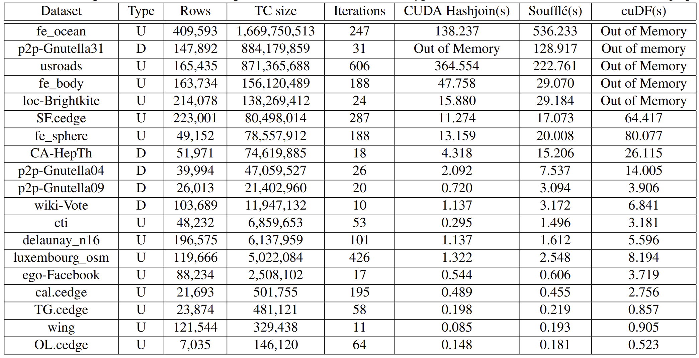

## Comparison between Souffle, CUDA, and cuDF



## Run instructions 
- To build and run:
```shell
make run
```

## Run instructions for ThetaGPU
- Run using Interactive node:
```shell
ssh USERNAME@theta.alcf.anl.gov
ssh thetagpusn1 # or module load cobalt/cobalt-gpu
qsub -I -n 1 -t 60 -q single-gpu -A dist_relational_alg
cd /lus/theta-fs0/projects/dist_relational_alg/shovon/GPUJoin/USENIXATC_2023/
git fetch
git reset --hard origin/main
make run
```
- Run using job script:
```
# submit job
ssh USERNAME@theta.alcf.anl.gov
module load cobalt/cobalt-gpu
cd /lus/theta-fs0/projects/dist_relational_alg/shovon/GPUJoin/USENIXATC_2023/job_scripts
git fetch
git reset --hard origin/main
chmod +x single-gpu-job.sh
chmod +x single-gpu-debug.sh
chmod +x hashjoin-job.sh
qsub -O single-gpu-job -e single-gpu-job.error single-gpu-job.sh
qsub -O single-gpu-debug -e single-gpu-debug.error single-gpu-debug.sh
qsub -O hashjoin-job -e hashjoin-job.error hashjoin-job.sh
qsub single-gpu-job.sh
qsub hashjoin-job.sh
```

- Debug mode and memory check:

```shell
# debug
make debug
cuda-memcheck  ./tc_cuda.out
cuda-memcheck --leak-check full ./tc_cuda.out
cuda-memcheck --leak-check full ./tc_cuda.out     
========= CUDA-MEMCHECK
========= This tool is deprecated and will be removed in a future release of the CUDA toolkit
========= Please use the compute-sanitizer tool as a drop-in replacement
Benchmark for talk 5
----------------------------------------------------------
....
========= LEAK SUMMARY: 0 bytes leaked in 0 allocations
========= ERROR SUMMARY: 0 errors

compute-sanitizer ./tc_cuda.out
========= COMPUTE-SANITIZER
Benchmark for talk 5
----------------------------------------------------------

...
========= ERROR SUMMARY: 0 errors
```

### SuiteSparse Data Collection
- Go to [https://sparse.tamu.edu/?per_page=All](https://sparse.tamu.edu/?per_page=All)
- Select Undirected Graph type
- See the Nonzeros column, number of edges will be half on Nonzeros in actual graph
- Click on the graph link and download Matrix Markey format (open the Matrix Market as new window and then reload)
- Open a text editor and delete the meta data
- Replace space with \t using regular expression and save it

### Sparse graphs
- [fe_sphere: data_49152](https://sparse.tamu.edu/DIMACS10/fe_sphere)
- [fe_body: data_163734](https://sparse.tamu.edu/DIMACS10/fe_body)
- [loc-Brightkite: data_214078](https://sparse.tamu.edu/SNAP/loc-Brightkite)

### References
- [Getting Started on ThetaGPU](https://docs.alcf.anl.gov/theta-gpu/getting-started/)
- [CUDA — Memory Model blog](https://medium.com/analytics-vidhya/cuda-memory-model-823f02cef0bf)
- [CUDA - Pinned memory](https://developer.nvidia.com/blog/how-optimize-data-transfers-cuda-cc/)
- [Stanford Large Network Dataset Collection](https://snap.stanford.edu/data/index.html)