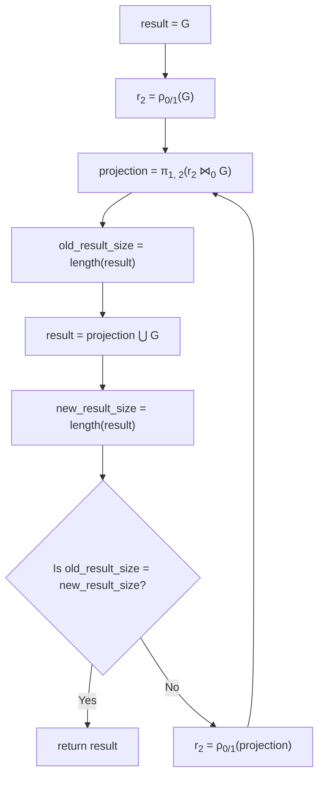
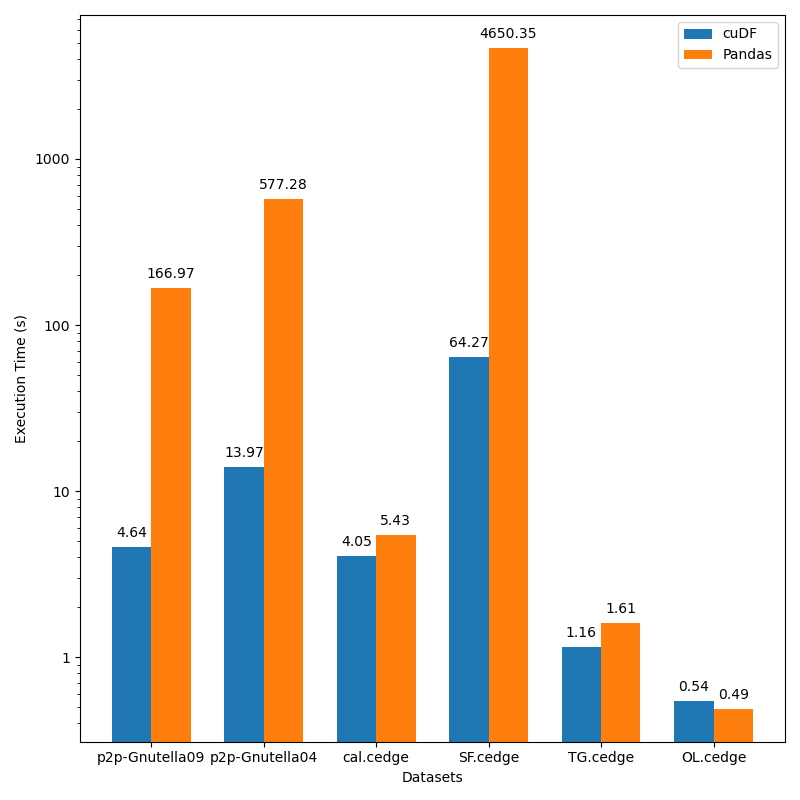

## cuDF vs Pandas DataFrame performance comparison

The following sections include the system configuration, the dataset, the
flowchart, and the benchmarking result.

### System configuration

- GPU information:
    - NVIDIA A100-SXM4-40GB
    - Driver Version: 470.129.06
    - CUDA Version: 11.4
- Hardware information:
    - Total Memory: 1.0T
    - CPU name: AMD EPYC 7742 64-Core Processor
    - CPU(s): 256
- OS information:
    - Operating System: Ubuntu 20.04.4 LTS
    - Kernel: Linux 5.4.0-121-generic
    - Architecture: x86-64
- Python package information:
    - Python version: 3.9.13
    - Conda version: conda 4.13.0
    - cuda-python: 11.7.0
    - cudatoolkit: 11.2.72
    - cudf: 22.06.01
    - pandas: 1.4.3

### Dataset

We used 2 datasets from
the [Stanford Large Network Dataset Collection](https://snap.stanford.edu/data/index.html)

- [Gnutella peer-to-peer network, August 9 2002 (p2p-Gnutella09)](https://snap.stanford.edu/data/p2p-Gnutella09.html)
  dataset:
    - Nodes 8114
    - Edges 26013
    - Matrix size 26013 x 2
    - File size 267K
- [Gnutella peer-to-peer network, August 4 2002 (p2p-Gnutella04)](https://snap.stanford.edu/data/p2p-Gnutella04.html)
  dataset:
    - Nodes 10876
    - Edges 39994
    - Matrix size 39994 x 2
    - File size 421K

We used 4 datasets from the
[Real Datasets for Spatial Databases: Road Networks and Points of Interest](https://www.cs.utah.edu/~lifeifei/SpatialDataset.htm):

- [California Road Network's Edges (cal.cedge)](https://www.cs.utah.edu/~lifeifei/research/tpq/cal.cedge):
    - Matrix size 21693 x 2 (source - destination)
    - File size 233K
- [San Francisco Road Network's Edges (SF.cedge)](https://www.cs.utah.edu/~lifeifei/research/tpq/SF.cedge):
    - Matrix size 223001 x 2 (source - destination)
    - File size 2.8M
- [TG Road Network's Edges (TG.cedge)](https://www.cs.utah.edu/~lifeifei/research/tpq/TG.cedge):
    - Matrix size 23874 x 2 (source - destination)
    - File size 252K
- [OL Road Network's Edges (OL.cedge)](https://www.cs.utah.edu/~lifeifei/research/tpq/OL.cedge):
    - Matrix size 7035 x 2 (source - destination)
    - File size 67K

### Benchmarks

We calculate execution times to calculate transitive closure for both cuDF and
Pandas DF on the same dataset in the mentioned environment:

- To generate result for transitive closure using Rapids cuDF:

```commandline
python transitive_closure.py
```

- To generate result for transitive closure using Pandas DF:

```commandline
python transitive_closure_pandas.py
```

### Flowchart



### Pandas vs CUDF performance comparison

- `cuDF` benchmark

| Dataset        | Number of rows   | TC size   | Iterations   | Time (s)   |
|----------------|------------------|-----------|--------------|------------|
| p2p-Gnutella09 | 26013            | 21402960  | 20           | 4.636441   |
| p2p-Gnutella04 | 39994            | 47059527  | 26           | 13.969293  |
| cal.cedge      | 21693            | 501755    | 195          | 4.054477   |
| SF.cedge       | 223001           | 80498014  | 287          | 64.265064  |
| TG.cedge       | 23874            | 481121    | 58           | 1.157264   |
| OL.cedge       | 7035             | 146120    | 64           | 0.544352   |

- `df` benchmark

| Dataset        | Number of rows   | TC size   | Iterations   | Time (s)    |
|----------------|------------------|-----------|--------------|-------------|
| p2p-Gnutella09 | 26013            | 21402960  | 20           | 166.969241  |
| p2p-Gnutella04 | 39994            | 47059527  | 26           | 577.280656  |
| cal.cedge      | 21693            | 501755    | 195          | 5.427228    |
| SF.cedge       | 223001           | 80498014  | 287          | 4650.348536 |
| TG.cedge       | 23874            | 481121    | 58           | 1.609337    |
| OL.cedge       | 7035             | 146120    | 64           | 0.490264    |

The cuDF shows significant performance gains for the same dataset using the
system configuration mentioned.

| Dataset           | cuDF (s)  | Pandas DF (s)   | Speedup |
|-------------------|-----------|-----------------|---------|
| p2p-Gnutella09    | 4.636441  | 166.969241      | 36.0x   |
| p2p-Gnutella04    | 13.969293 | 577.280656      | 41.3x   |
| cal.cedge         | 4.054477  | 5.427228        | 1.3x    |
| SF.cedge          | 64.265064 | 4650.348536     | 72.4x   |
| TG.cedge          | 1.157264  | 1.609337        | 1.4x    |
| OL.cedge          | 0.544352  | 0.490264        | 0.9x    |


Figure: Transitive closure comparison

### Notes

| Number of rows | TC size | Iterations | Time (s)            |
|----------------| --- | --- |---------------------|
| 223001         | 80498014 | 287 | 64.129467 (chained) |
| 223001         | 80498014 | 287 | 64.160251 (original) |
| 179179         | 275761936 | 3277 | 1513.897926 |

### Reference

- [Documentation on CUDF Drop](https://docs.rapids.ai/api/cudf/nightly/api_docs/api/cudf.DataFrame.drop.html)
- [Documentation on CUDF Drop Duplicates](https://docs.rapids.ai/api/cudf/stable/api_docs/api/cudf.DataFrame.drop_duplicates.html?highlight=duplicate#cudf.DataFrame.drop_duplicates)
- [Documentation on CUDF concatenate](https://docs.rapids.ai/api/cudf/stable/api_docs/api/cudf.concat.html?highlight=concat#cudf.concat)
- [California road network](https://snap.stanford.edu/data/roadNet-CA.html)
- (Leskovec 2009) J. Leskovec, K. Lang, A. Dasgupta, M. Mahoney. Community
  Structure in Large Networks: Natural Cluster Sizes and the Absence of Large
  Well-Defined Clusters. Internet Mathematics 6(1) 29--123, 2009.
- [Real Datasets for Spatial Databases: Road Networks and Points of Interest](https://www.cs.utah.edu/~lifeifei/SpatialDataset.htm)
- [Stanford Large Network Dataset Collection](https://snap.stanford.edu/data/index.html)
- [Flowcharts - Basic Syntax](https://mermaid-js.github.io/mermaid/#/flowchart)