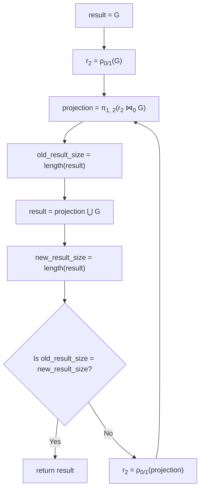

## cuDF vs Pandas DataFrame performance comparison

The following sections include the system configuration, the dataset, the flowchart, and the benchmarking result.

### System configuration
- GPU information:
  - NVIDIA A100-SXM4-40GB
  - Driver Version: 470.129.06
  - CUDA Version: 11.4
- Hardware information:
  - Total Memory: 1.0T 
  - CPU name: AMD EPYC 7742 64-Core Processor
  - CPU(s): 256 
- OS information:
  - Operating System: Ubuntu 20.04.4 LTS
  - Kernel: Linux 5.4.0-121-generic
  - Architecture: x86-64
- Python package information:
  - Python version: 3.9.13
  - Conda version: conda 4.13.0 
  - cuda-python: 11.7.0
  - cudatoolkit: 11.2.72
  - cudf: 22.06.01 
  - pandas: 1.4.3

### Dataset

We used [San Francisco Road Network's Edges](https://www.cs.utah.edu/~lifeifei/research/tpq/SF.cedge) dataset from the 
[Real Datasets for Spatial Databases: Road Networks and Points of Interest](https://www.cs.utah.edu/~lifeifei/SpatialDataset.htm).

The dataset has the following properties:

- Matrix size 223001 x 2 (source - destination)
- File size 2.8M 

### Benchmarks

We calculate execution times to calculate transitive closure for both cuDF and Pandas DF on the same dataset in the mentioned environment:

- To generate result for transitive closure using Rapids cuDF:
```commandline
python transitive_closure.py
```
- To generate result for transitive closure using Pandas DF:
```commandline
python transitive_closure_pandas.py
```

### Flowchart



### Pandas vs CUDF performance comparison
- For `data_223001` datasets (44K data_223001.txt):

- `cuDF` benchmark

| Number of rows | TC size | Iterations | Time (s)            |
| --- | --- | --- |---------------------|
| 223001 | 80498014 | 287 | 64.129467 (chained) |
| 223001 | 80498014 | 287 | 64.160251 (original) |

-`df` benchmark

| Number of rows | TC size | Iterations | Time (s) |
| --- | --- | --- | --- |
| 223001 | 80498014 | 287 | 4650.348536 |

The cuDF shows significant performance gains for the same dataset using the system configuration mentioned.

| Metric               | cuDF (s) | Pandas DF (s) | Speedup |
|----------------------|----------|---------------|--------|
| Execution time       | 64.160251 | 4650.348536     | 72.5x  |

### Reference
- [Documentation on CUDF Drop](https://docs.rapids.ai/api/cudf/nightly/api_docs/api/cudf.DataFrame.drop.html)
- [Documentation on CUDF Drop Duplicates](https://docs.rapids.ai/api/cudf/stable/api_docs/api/cudf.DataFrame.drop_duplicates.html?highlight=duplicate#cudf.DataFrame.drop_duplicates)
- [Documentation on CUDF concatenate](https://docs.rapids.ai/api/cudf/stable/api_docs/api/cudf.concat.html?highlight=concat#cudf.concat)
- [California road network](https://snap.stanford.edu/data/roadNet-CA.html)
- (Leskovec 2009) J. Leskovec, K. Lang, A. Dasgupta, M. Mahoney. Community 
  Structure in Large Networks: Natural Cluster Sizes and the Absence of Large Well-Defined Clusters. Internet Mathematics 6(1) 29--123, 2009.
- [Real Datasets for Spatial Databases: Road Networks and Points of Interest](https://www.cs.utah.edu/~lifeifei/SpatialDataset.htm)
- [San Francisco Road Network's Edges](https://www.cs.utah.edu/~lifeifei/research/tpq/SF.cedge)
- [Flowcharts - Basic Syntax](https://mermaid-js.github.io/mermaid/#/flowchart)