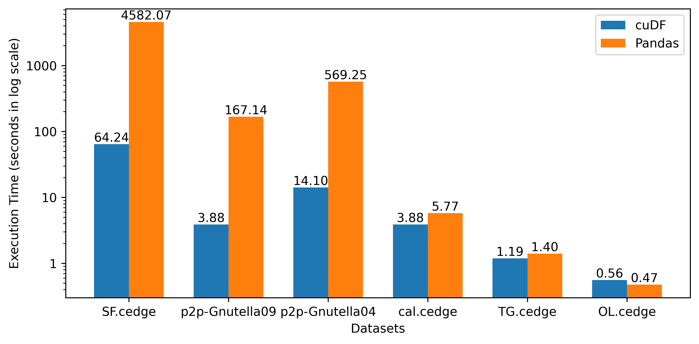

## cuDF vs Pandas DataFrame performance comparison

The following sections include the system configuration, the dataset, the
flowchart, and the benchmarking result.

### System configuration

- GPU information:
    - NVIDIA A100-SXM4-40GB
    - Driver Version: 470.129.06
    - CUDA Version: 11.4
- Hardware information:
    - Total Memory: 1.0T
    - CPU name: AMD EPYC 7742 64-Core Processor
    - CPU(s): 256
- OS information:
    - Operating System: Ubuntu 20.04.4 LTS
    - Kernel: Linux 5.4.0-121-generic
    - Architecture: x86-64
- Python package information:
    - Python version: 3.9.13
    - Conda version: conda 4.13.0
    - cuda-python: 11.7.0
    - cudatoolkit: 11.2.72
    - cudf: 22.06.01
    - pandas: 1.4.3

### Dataset

We used datasets from
the [Stanford Large Network Dataset Collection](https://snap.stanford.edu/data/index.html) and the [Real Datasets for Spatial Databases: Road Networks and Points of Interest](https://www.cs.utah.edu/~lifeifei/SpatialDataset.htm).


| Graph          | Type       | `V`       | `E`        | 
|----------------|------------|-----------|------------|
| p2p-Gnutella09 | Directed   | 8,114     | 26,013     |
| p2p-Gnutella04 | Directed   | 10,876    | 39,994     |
| Skitter        | Undirected | 1,696,415 | 11,095,298 |
| roadNet-CA     | Undirected | 1,965,206 | 2,766,607  |
| roadNet-TX     | Undirected | 1,379,917 | 1,921,660  |
| roadNet-PA     | Undirected | 1,088,092 | 1,541,898  |
| SF.cedge       | Undirected | 1,74,955  | 2,23,001   |
| cal.cedge      | Undirected | 21,048    | 21,693     |
| TG.cedge       | Undirected | 18,263    | 23,874     |
| OL.cedge       | Undirected | 6,105     | 7,035      |

- `V` represents the number of nodes and `E` represents the number of edges of the graph.

### Benchmarks

We calculate execution times to calculate the basic relational operations, triangle counting, and transitive closure computation for both cuDF and
Pandas DF on the same dataset in the mentioned environment:

- To generate result for basic operations using cuDF and Pandas:

```commandline
python basic_operations.py
```

- To generate result for triangle counting using Rapids cuDF:

```commandline
python triangle_counting.py
```

- To generate result for triangle counting using Pandas DF:

```commandline
python triangle_counting_pandas.py
```

- To generate result for transitive closure using Rapids cuDF:

```commandline
python transitive_closure.py
```

- To generate result for transitive closure using Pandas DF:

```commandline
python transitive_closure_pandas.py
```

### Flowchart (Transitive closure)


## Pandas vs CUDF performance comparison

- Benchmark for triangle counting

| Dataset        | Triangles    | cuDF(s)    | Pandas(s)    | Speedup   |
|----------------|--------------|------------|--------------|-----------|
| Skitter        | 28,769,868   | 1.0340     | 152.7032     | 147.7x    |
| roadNet-CA     | 120,676      | 0.1593     | 3.0106       | 18.9x     |
| roadNet-TX     | 82,869       | 0.1180     | 1.9466       | 16.5x     |
| roadNet-PA     | 67,150       | 0.1084     | 1.4777       | 13.6x     |
| SF.edge        | 4,036        | 0.0877     | 0.1482       | 1.7x      |
| p2p-Gnutella09 | 2,354        | 0.0486     | 0.0256       | 0.5x      |


- Benchmark for transitive closure

| Dataset        | TC size    | Iterations    | cuDF(s)    | Pandas(s)   | Speedup   |
|----------------|------------|---------------|------------|-------------|-----------|
| SF.cedge       | 80,498,014 | 287           | 64.235     | 4582.067    | 71.3x     |
| p2p-Gnutella09 | 21,402,960 | 20            | 3.881      | 167.143     | 43.1x     |
| p2p-Gnutella04 | 47,059,527 | 26            | 14.104     | 569.249     | 40.4x     |
| cal.cedge      | 501,755    | 195           | 3.883      | 5.769       | 1.5x      |
| TG.cedge       | 481,121    | 58            | 1.191      | 1.400       | 1.2x      |
| OL.cedge       | 146,120    | 64            | 0.557      | 0.474       | 0.9x      |

### Figures


- Figure: Comparison for basic operations


- Figure: Comparison for triangle counting



Figure: Comparison for transitive closure


### Reference

- [Documentation on CUDF Drop](https://docs.rapids.ai/api/cudf/nightly/api_docs/api/cudf.DataFrame.drop.html)
- [Documentation on CUDF Drop Duplicates](https://docs.rapids.ai/api/cudf/stable/api_docs/api/cudf.DataFrame.drop_duplicates.html?highlight=duplicate#cudf.DataFrame.drop_duplicates)
- [Documentation on CUDF concatenate](https://docs.rapids.ai/api/cudf/stable/api_docs/api/cudf.concat.html?highlight=concat#cudf.concat)
- [California road network](https://snap.stanford.edu/data/roadNet-CA.html)
- (Leskovec 2009) J. Leskovec, K. Lang, A. Dasgupta, M. Mahoney. Community
  Structure in Large Networks: Natural Cluster Sizes and the Absence of Large
  Well-Defined Clusters. Internet Mathematics 6(1) 29--123, 2009.
- [Real Datasets for Spatial Databases: Road Networks and Points of Interest](https://www.cs.utah.edu/~lifeifei/SpatialDataset.htm)
- [Stanford Large Network Dataset Collection](https://snap.stanford.edu/data/index.html)
- [Flowcharts - Basic Syntax](https://mermaid-js.github.io/mermaid/#/flowchart)
