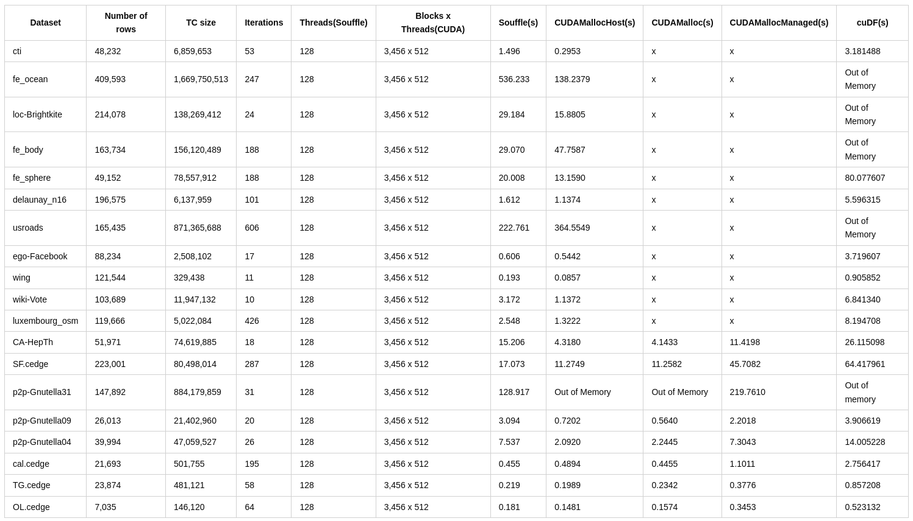

## Comparison between Souffle, CUDA, and cuDF



## Run instructions
- To build and run:
```shell
make run
```

## Run instructions for theta
```shell
ssh USERNAME@theta.alcf.anl.gov
ssh thetagpusn1 # or module load cobalt/cobalt-gpu
qsub -I -n 1 -t 60 -q single-gpu -A dist_relational_alg
cd /lus/theta-fs0/projects/dist_relational_alg/shovon/GPUJoin/tc_cuda/
git fetch
git reset --hard origin/main
make run

# debug
make debug
cuda-memcheck  ./tc_cuda.out
cuda-memcheck --leak-check full ./tc_cuda.out
cuda-memcheck --leak-check full ./tc_cuda.out     

# submit job
ssh USERNAME@theta.alcf.anl.gov
module load cobalt/cobalt-gpu
cd /lus/theta-fs0/projects/dist_relational_alg/shovon/GPUJoin/tc_cuda/job_scripts
git fetch
git reset --hard origin/main
chmod +x single-gpu-job.sh
chmod +x single-gpu-debug.sh
chmod +x hashjoin-job.sh
qsub -O single-gpu-job -e single-gpu-job.error single-gpu-job.sh
qsub -O single-gpu-debug -e single-gpu-debug.error single-gpu-debug.sh
qsub -O hashjoin-job -e hashjoin-job.error hashjoin-job.sh

========= CUDA-MEMCHECK
========= This tool is deprecated and will be removed in a future release of the CUDA toolkit
========= Please use the compute-sanitizer tool as a drop-in replacement
Benchmark for talk 5
----------------------------------------------------------
....
========= LEAK SUMMARY: 0 bytes leaked in 0 allocations
========= ERROR SUMMARY: 0 errors

compute-sanitizer ./tc_cuda.out
========= COMPUTE-SANITIZER
Benchmark for talk 5
----------------------------------------------------------

...
========= ERROR SUMMARY: 0 errors


Iteration: 9
join_result_rows: 1,533,673,887
projection_rows: 735,564,909
concatenated_rows: 1,399,870,967
deduplicated_result_rows:754,453,946

Iteration: 10
join_result_rows: 1,749,702,039
========= Program hit cudaErrorMemoryAllocation (error 2) due to "out of memory" on CUDA API call to cudaMalloc.
=========     Saved host backtrace up to driver entry point at error
=========     Host Frame:/lib/x86_64-linux-gnu/libcuda.so.1 [0x3d6d23]
=========     Host Frame:./tc_cuda.out [0x5dbdb]
=========     Host Frame:./tc_cuda.out [0x169b4]
=========     Host Frame:./tc_cuda.out [0x1b5bd]
=========     Host Frame:./tc_cuda.out [0xfa6e]
=========     Host Frame:./tc_cuda.out [0x115ef]
=========     Host Frame:./tc_cuda.out [0xc869]
=========     Host Frame:/lib/x86_64-linux-gnu/libc.so.6 (__libc_start_main + 0xf3) [0x24083]
=========     Host Frame:./tc_cuda.out [0xc9ce]
=========
========= Program hit cudaErrorMemoryAllocation (error 2) due to "out of memory" on CUDA API call to cudaGetLastError.
=========     Saved host backtrace up to driver entry point at error
=========     Host Frame:/lib/x86_64-linux-gnu/libcuda.so.1 [0x3d6d23]
=========     Host Frame:./tc_cuda.out [0x56134]
=========     Host Frame:./tc_cuda.out [0x16a5d]
=========     Host Frame:./tc_cuda.out [0x1b5bd]
=========     Host Frame:./tc_cuda.out [0xfa6e]
=========     Host Frame:./tc_cuda.out [0x115ef]
=========     Host Frame:./tc_cuda.out [0xc869]
=========     Host Frame:/lib/x86_64-linux-gnu/libc.so.6 (__libc_start_main + 0xf3) [0x24083]
=========     Host Frame:./tc_cuda.out [0xc9ce]
=========
terminate called after throwing an instance of 'thrust::system::detail::bad_alloc'
  what():  std::bad_alloc: cudaErrorMemoryAllocation: out of memory
========= Error: process didn't terminate successfully
========= No CUDA-MEMCHECK results found

```
### Memory management
- Pageable memory vs pinned memory:
```shell
# Pageable memory
CUDA memcpy HtoD: 25.856us
CUDA memcpy DtoH: 180.32ms

# Pinned memory
CUDA memcpy HtoD: 25.983us
CUDA memcpy DtoH: 28.998ms
```

### Comparison between cuDF and CUDA for isolocate join

| Dataset | Number of rows | #Join    | Blocks x Threads | CUDA(s) | cuDF(s)   | 
| --- |----------------|----------| --- | --- |-----------|
| CA-HepTh | 51,971         | 651,469 | 3,456 x 512 | 0.046798 | 0.011729  |
| SF.cedge | 2,23,001       | 273,550 | 3,456 x 512 | 0.098917 | 0.014935  |
| ego-Facebook | 88,234         | 2,690,019 | 3,456 x 512 | 0.087055 | 0.016591  |
| wiki-Vote | 1,03,689       | 4,542,805 | 3,456 x 512 | 0.075709 | 0.019290  |
| p2p-Gnutella09 | 26,013 | 108,864 | 3,456 x 512 | 0.035585 | 0.008280  |
| p2p-Gnutella04 | 39,994 | 180,230 | 3,456 x 512 | 0.044338 | 0.009489  |
| cal.cedge | 21,693 | 19,836 | 3,456 x 512 | 0.037094 |  0.004164 |
| TG.cedge | 23,874 | 24,274 | 3,456 x 512 | 0.045365 | 0.004714 |
| OL.cedge | 7,035 | 7,445 | 3,456 x 512 | 0.002734 | 0.004074 |
| luxembourg_osm | 119,666 | 114,532 | 3,456 x 512 | 0.055933 | 0.008111 |
| fe_sphere | 49,152 | 146,350 | 3,456 x 512 | 0.043725 | 0.009437 |
| fe_body | 163,734 | 609,957 | 3,456 x 512 | 0.071094 | 0.014670 |
| cti | 48,232 | 130,492 | 3,456 x 512 | 0.036796 | 0.007038 |
| fe_ocean | 409,593 | 1,175,076 | 3,456 x 512 | 0.175138 | 0.019214 |
| wing | 121,544 | 116,371 | 3,456 x 512 | 0.067559 | 0.008459 |
| loc-Brightkite | 214,078 | 3,368,451 | 3,456 x 512 | 0.098373 | 0.025354 |
| delaunay_n16 | 196,575 | 393,028 | 3,456 x 512 | 0.086225 | 0.014754 |
| usroads | 165,435 | 206,898 | 3,456 x 512 | 0.083588 | 0.013676 |


### SuiteSparse Data Collection
- Go to [https://sparse.tamu.edu/?per_page=All](https://sparse.tamu.edu/?per_page=All)
- Select Undirected Graph type
- See the Nonzeros column, number of edges will be half on Nonzeros in actual graph
- Click on the graph link and download Matrix Markey format (open the Matrix Market as new window and then reload)
- Open a text editor and delete the meta data
- Replace space with \t using regular expression and save it

### Sparse graphs
- [fe_sphere: data_49152](https://sparse.tamu.edu/DIMACS10/fe_sphere)
- [fe_body: data_163734](https://sparse.tamu.edu/DIMACS10/fe_body)
- [loc-Brightkite: data_214078](https://sparse.tamu.edu/SNAP/loc-Brightkite)

### References
- [Getting Started on ThetaGPU](https://docs.alcf.anl.gov/theta-gpu/getting-started/)
- [CUDA — Memory Model blog](https://medium.com/analytics-vidhya/cuda-memory-model-823f02cef0bf)
- [CUDA - Pinned memory](https://developer.nvidia.com/blog/how-optimize-data-transfers-cuda-cc/)
- [Stanford Large Network Dataset Collection](https://snap.stanford.edu/data/index.html)