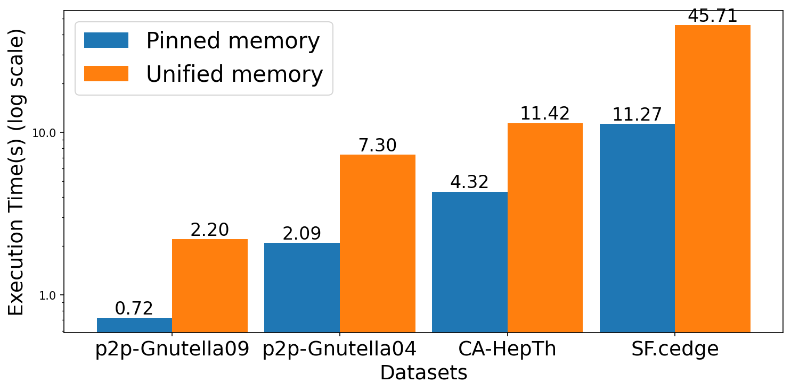
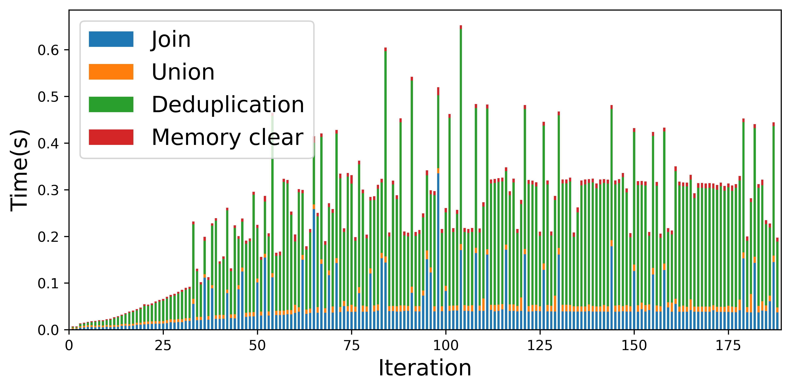
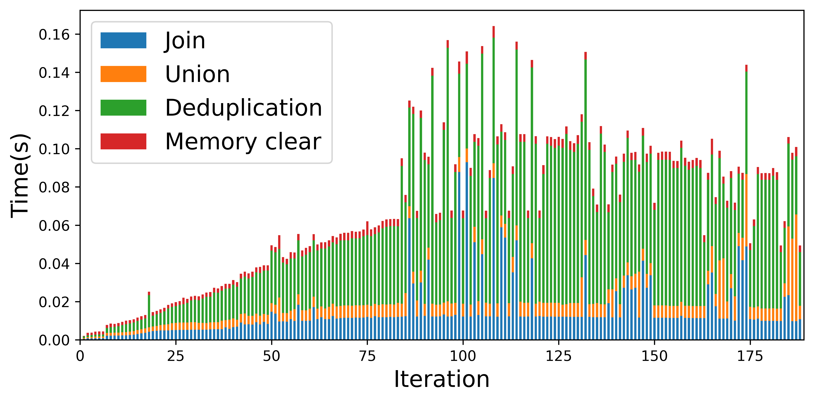

## Chart generator
- Generate stacked bar chart on the iteration results (Join, Union, Deduplication, and memory clear time of each iteration).
- Generate bar chart comparing CUDA pinned memory with CUDA unified memory model.

### Run instruction
- Install the packages listed in [requirements.txt](requirements.txt) using Python 3 and pip
- Run the file [generate_stacked_bar_chart.py](generate_stacked_bar_chart.py) for iteration level stacked bar chart generation 
- Run the file [generate_bar_chart.py](generate_bar_chart.py) for memory model bar chart generation

### Output directory
- Stacked bar charts generated from the input [datafiles](data) are stored in [output](output) folder
- Bar charts generated comparing memory model: [output/pinned_vs_unified.png](output/pinned_vs_unified.png)

### Demo 
#### Comparison between CUDA pinned memory and CUDA unified memory

#### Iteration level operation breakdown
- SF.cedge:
  
- CA-HepTh:
  
- fe_body:
  
- fe_sphere:
  

- For more iteration level operation breakdown check [output](output) folder.