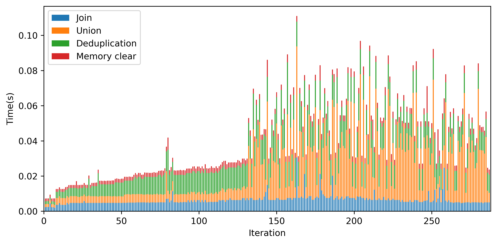
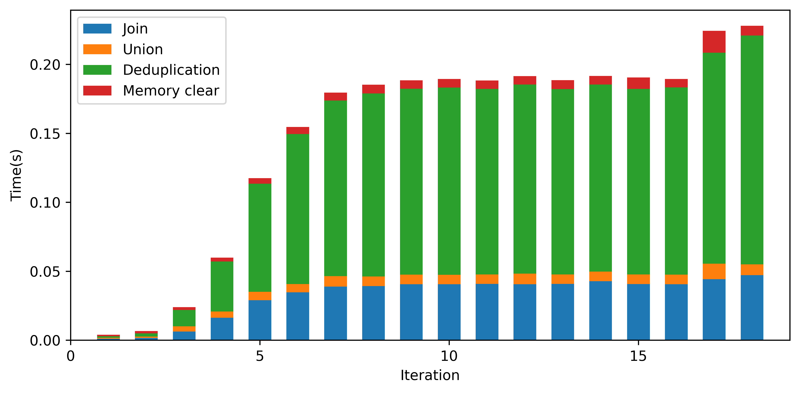
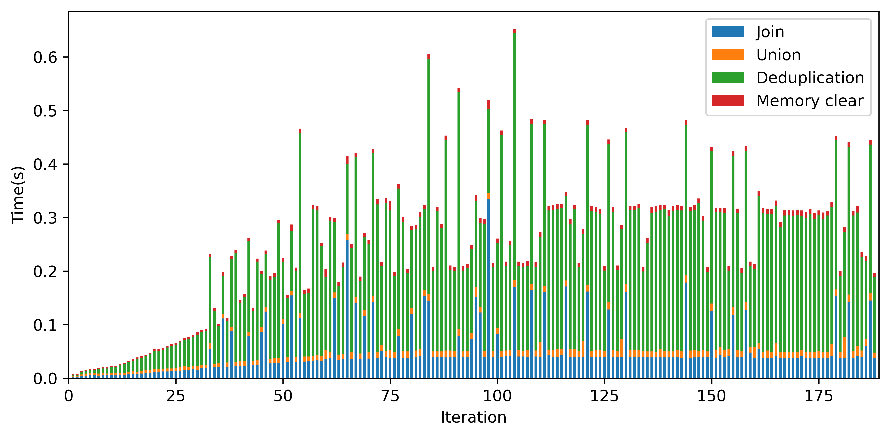
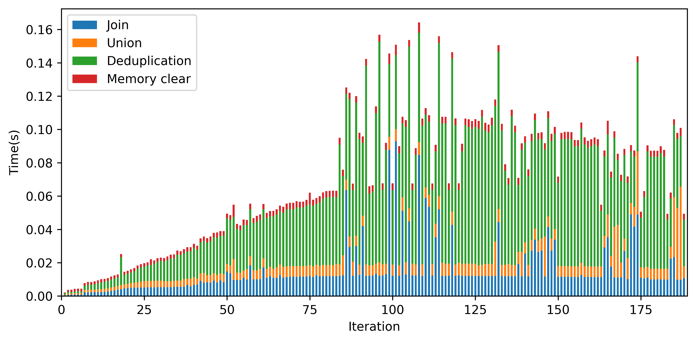

## Stacked bar chart generator
Generate stacked bar chart on the iteration results (Join, Union, Deduplication, and memory clear time of each iteration).

### Run instruction
- Install the packages listed in [requirements.txt](requirements.txt) using Python 3 and pip
- Run the file [generate_chart.py](generate_chart.py)

### Output directory
- Stacked bar charts generated from the input [datafiles](data) are stored in [output](output) folder

### Demo 
- SF.cedge:
  
- CA-HepTh:
  
- fe_body:
  
- fe_sphere:
  

[output](output) folder contains more graphs